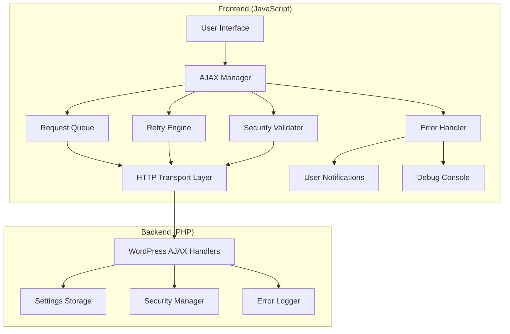
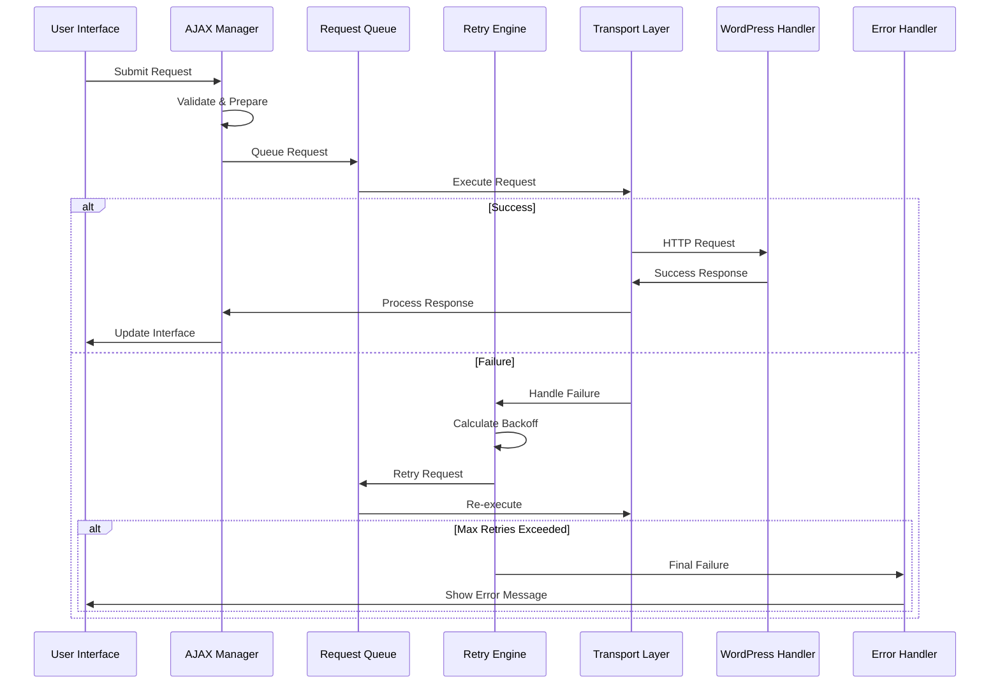

# Design Document

## Overview

The AJAX Communication System Overhaul will replace the existing fragmented AJAX implementation with a robust, enterprise-grade system that provides reliable communication between the WordPress frontend and backend. The system will feature automatic retry logic with exponential backoff, comprehensive error handling, request queuing to prevent race conditions, and extensive user feedback mechanisms.

The design builds upon the existing modular architecture while addressing critical gaps in error recovery, security validation, and user experience. The system will maintain backward compatibility while introducing modern web standards and best practices.

## Architecture

### High-Level Architecture



### Request Flow Architecture



## Components and Interfaces

### 1. Enhanced AJAX Manager (JavaScript)

**Location**: `assets/js/modules/ajax-manager.js`

**Responsibilities**:
- Centralized request management and coordination
- Request queuing and deduplication
- Retry logic with exponential backoff
- Performance monitoring and metrics collection
- User notification coordination

**Key Methods**:
```javascript
class LASAjaxManager {
    // Core request methods
    async request(action, data, options)
    async batchRequest(requests)
    
    // Queue management
    queueRequest(config)
    processQueue()
    prioritizeRequest(requestId, priority)
    
    // Retry and error handling
    retryRequest(config, error)
    shouldRetry(error)
    calculateBackoffDelay(attempt)
    
    // Performance and monitoring
    getMetrics()
    getRequestHistory()
    reportPerformance()
    
    // Configuration
    configure(options)
    setTimeouts(timeouts)
    setRetryPolicy(policy)
}
```

### 2. HTTP Transport Layer (JavaScript)

**Location**: `assets/js/modules/http-transport.js`

**Responsibilities**:
- Modern fetch() API with XMLHttpRequest fallback
- Request timeout management
- Response processing and validation
- Network error detection and classification

**Key Methods**:
```javascript
class HTTPTransport {
    async sendRequest(config)
    async fetchRequest(data, signal)
    async xhrRequest(data, signal)
    processResponse(response, config)
    detectNetworkError(error)
    validateResponse(response)
}
```

### 3. Request Queue Manager (JavaScript)

**Location**: `assets/js/modules/request-queue.js`

**Responsibilities**:
- FIFO queue with priority support
- Request deduplication
- Concurrent request limiting
- Queue persistence during page navigation

**Key Methods**:
```javascript
class RequestQueue {
    enqueue(request, priority)
    dequeue()
    deduplicate(request)
    getPendingRequests()
    clearQueue()
    persistQueue()
    restoreQueue()
}
```

### 4. Retry Engine (JavaScript)

**Location**: `assets/js/modules/retry-engine.js`

**Responsibilities**:
- Exponential backoff calculation
- Retry policy enforcement
- Failure classification
- Circuit breaker pattern implementation

**Key Methods**:
```javascript
class RetryEngine {
    shouldRetry(error, attempt, config)
    calculateDelay(attempt, baseDelay)
    classifyError(error)
    updateCircuitBreaker(action, success)
    isCircuitOpen(action)
}
```

### 5. Enhanced AJAX Handlers (PHP)

**Location**: `includes/ajax-handlers.php`

**Responsibilities**:
- Secure request processing with comprehensive validation
- Standardized response formatting
- Performance monitoring and logging
- Bulk operation support

**Key Methods**:
```php
class LAS_Ajax_Handlers {
    // Core handlers
    public function handle_save_settings()
    public function handle_load_settings()
    public function handle_batch_operations()
    public function handle_get_preview_css()
    
    // Security and validation
    private function validate_request($action, $data)
    private function sanitize_settings($settings)
    private function check_rate_limits($user_id)
    
    // Response formatting
    private function send_success_response($data, $meta)
    private function send_error_response($error, $code, $meta)
    
    // Performance monitoring
    private function log_performance_metrics($action, $duration, $memory)
    private function detect_slow_operations($duration, $threshold)
}
```

### 6. Security Validator (PHP)

**Location**: `includes/SecurityValidator.php` (Enhanced)

**Responsibilities**:
- Nonce validation and refresh
- Capability checking with granular permissions
- Input sanitization and validation
- Rate limiting and abuse prevention

**Key Methods**:
```php
class LAS_Security_Validator {
    public function verify_nonce($nonce, $action)
    public function refresh_nonce($action)
    public function check_capabilities($required_caps)
    public function sanitize_settings($settings)
    public function check_rate_limit($user_id, $action)
    public function log_security_event($event, $context)
}
```

### 7. User Notification System (JavaScript)

**Location**: `assets/js/modules/notification-system.js`

**Responsibilities**:
- Toast notifications with different severity levels
- Progress indicators for long operations
- Error message translation and localization
- Accessibility compliance (ARIA labels, screen reader support)

**Key Methods**:
```javascript
class NotificationSystem {
    showSuccess(message, options)
    showError(message, options)
    showWarning(message, options)
    showProgress(message, percentage)
    showRetryPrompt(message, retryCallback)
    dismissAll()
    setAccessibilityMode(enabled)
}
```

## Data Models

### Request Configuration Model

```javascript
const RequestConfig = {
    id: 'string',           // Unique request identifier
    action: 'string',       // WordPress AJAX action
    data: 'object',         // Request payload
    options: {
        method: 'POST',     // HTTP method
        timeout: 30000,     // Request timeout in ms
        retries: 3,         // Maximum retry attempts
        priority: 'normal', // Queue priority (high, normal, low)
        dedupe: true,       // Enable request deduplication
        batch: false,       // Part of batch operation
        skipQueue: false    // Skip queue for urgent requests
    },
    metadata: {
        startTime: 'number',    // Request start timestamp
        attempt: 'number',      // Current attempt number
        userAgent: 'string',    // Client user agent
        sessionId: 'string'     // User session identifier
    }
};
```

### Response Model

```javascript
const ResponseModel = {
    success: 'boolean',     // Operation success status
    data: 'any',           // Response payload
    meta: {
        timestamp: 'number',        // Server timestamp
        executionTime: 'number',    // Server execution time (ms)
        memoryUsage: 'number',      // Memory usage (bytes)
        requestId: 'string',        // Request identifier
        version: 'string'           // Plugin version
    },
    errors: [{
        code: 'string',         // Error code
        message: 'string',      // Human-readable message
        field: 'string',        // Related field (if applicable)
        severity: 'string'      // Error severity (error, warning, info)
    }]
};
```

### Performance Metrics Model

```javascript
const PerformanceMetrics = {
    requests: {
        total: 'number',        // Total requests made
        successful: 'number',   // Successful requests
        failed: 'number',       // Failed requests
        retried: 'number'       // Requests that were retried
    },
    timing: {
        averageResponseTime: 'number',  // Average response time (ms)
        slowestRequest: 'number',       // Slowest request time (ms)
        fastestRequest: 'number',       // Fastest request time (ms)
        totalTime: 'number'             // Total time spent on requests
    },
    queue: {
        maxLength: 'number',        // Maximum queue length reached
        averageWaitTime: 'number',  // Average time in queue (ms)
        currentLength: 'number'     // Current queue length
    },
    errors: {
        networkErrors: 'number',    // Network-related errors
        serverErrors: 'number',     // Server-side errors (5xx)
        clientErrors: 'number',     // Client-side errors (4xx)
        timeouts: 'number'          // Timeout errors
    }
};
```

## Error Handling

### Error Classification System

```javascript
const ErrorTypes = {
    NETWORK_ERROR: {
        code: 'NETWORK_ERROR',
        retryable: true,
        userMessage: 'Connection problem detected. Retrying...',
        logLevel: 'warning'
    },
    SERVER_ERROR: {
        code: 'SERVER_ERROR',
        retryable: true,
        userMessage: 'Server temporarily unavailable. Retrying...',
        logLevel: 'error'
    },
    CLIENT_ERROR: {
        code: 'CLIENT_ERROR',
        retryable: false,
        userMessage: 'Invalid request. Please refresh the page.',
        logLevel: 'error'
    },
    TIMEOUT_ERROR: {
        code: 'TIMEOUT_ERROR',
        retryable: true,
        userMessage: 'Request timed out. Retrying with longer timeout...',
        logLevel: 'warning'
    },
    SECURITY_ERROR: {
        code: 'SECURITY_ERROR',
        retryable: false,
        userMessage: 'Security validation failed. Please refresh the page.',
        logLevel: 'error'
    },
    RATE_LIMIT_ERROR: {
        code: 'RATE_LIMIT_ERROR',
        retryable: true,
        userMessage: 'Too many requests. Please wait a moment...',
        logLevel: 'info'
    }
};
```

### Error Recovery Strategies

1. **Automatic Retry with Exponential Backoff**
   - Base delay: 1000ms
   - Maximum delay: 30000ms
   - Jitter: ±10% to prevent thundering herd
   - Maximum attempts: 3

2. **Nonce Refresh on Security Errors**
   - Automatic nonce refresh for expired tokens
   - Transparent retry after nonce update
   - User notification only on repeated failures

3. **Circuit Breaker Pattern**
   - Track failure rates per action
   - Open circuit after 50% failure rate
   - Half-open state for gradual recovery
   - Automatic reset after success

4. **Graceful Degradation**
   - Fallback to basic functionality on persistent errors
   - Local storage for offline capability
   - User-friendly error messages with recovery suggestions

## Testing Strategy

### Unit Testing

**JavaScript Tests** (`tests/js/test-ajax-*.js`):
- Request queue operations
- Retry logic and backoff calculations
- Error classification and handling
- Performance metrics collection
- Security validation

**PHP Tests** (`tests/php/TestAjax*.php`):
- AJAX handler security validation
- Response formatting consistency
- Performance monitoring accuracy
- Rate limiting functionality
- Bulk operation processing

### Integration Testing

**End-to-End Scenarios**:
- Complete settings save workflow with retries
- Network failure recovery
- Concurrent request handling
- Security error recovery with nonce refresh
- Performance under load

**Cross-Browser Testing**:
- Modern browsers (Chrome, Firefox, Safari, Edge)
- Legacy browser fallbacks (IE11 with XMLHttpRequest)
- Mobile browser compatibility
- Network condition simulation

### Performance Testing

**Load Testing**:
- Concurrent request handling (up to 100 simultaneous)
- Queue performance under stress
- Memory usage monitoring
- Response time degradation analysis

**Stress Testing**:
- Network failure simulation
- Server error injection
- Timeout scenario testing
- Rate limiting validation

### Security Testing

**Penetration Testing**:
- CSRF token validation
- SQL injection prevention
- XSS protection verification
- Rate limiting bypass attempts
- Privilege escalation testing

**Compliance Testing**:
- WordPress coding standards
- Security best practices validation
- OWASP guidelines compliance
- Data sanitization verification

## Implementation Phases

### Phase 1: Core Infrastructure
- Enhanced AJAX Manager with queue system
- HTTP Transport Layer with fetch/XHR fallback
- Basic retry logic with exponential backoff
- Security validator enhancements

### Phase 2: Advanced Features
- Request deduplication and batching
- Circuit breaker pattern implementation
- Performance monitoring and metrics
- Comprehensive error classification

### Phase 3: User Experience
- Advanced notification system
- Progress indicators and loading states
- Accessibility improvements
- Mobile optimization

### Phase 4: Monitoring and Analytics
- Performance dashboard
- Error tracking and reporting
- Usage analytics
- Optimization recommendations

## Security Considerations

### Input Validation
- Comprehensive sanitization of all input data
- Type checking and format validation
- Size limits for request payloads
- Whitelist-based validation for critical fields

### Authentication and Authorization
- WordPress nonce validation on every request
- Capability checking with granular permissions
- Session validation and timeout handling
- Rate limiting per user and IP address

### Data Protection
- Sensitive data encryption in transit
- Secure error messages (no information leakage)
- Audit logging for security events
- GDPR compliance for user data handling

### Attack Prevention
- CSRF protection with rotating tokens
- SQL injection prevention through prepared statements
- XSS protection with output escaping
- DoS protection through rate limiting and request queuing