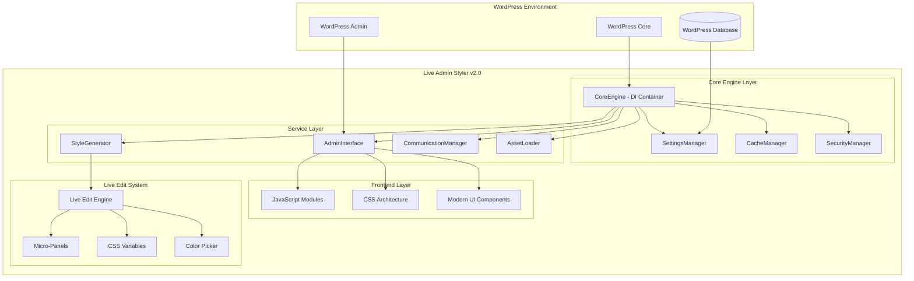

# Design Document

## Overview

Live Admin Styler v2.0 represents a complete architectural transformation from a monolithic WordPress plugin to a modern, enterprise-grade solution. The design implements a service-oriented architecture with dependency injection, modular JavaScript components, optimized asset management, and a comprehensive live editing system. The architecture prioritizes performance, security, maintainability, and user experience while maintaining full WordPress compatibility.

## Architecture

### High-Level System Architecture



### Service-Oriented Architecture

The plugin follows a service-oriented architecture with dependency injection, ensuring loose coupling and high testability:

1. **CoreEngine** - Central dependency injection container and service orchestrator
2. **Service Layer** - Specialized services handling specific domains
3. **Interface Layer** - User interface and communication management
4. **Live Edit System** - Real-time editing capabilities

## Components and Interfaces

### Core Engine and Dependency Injection

**CoreEngine.php**
```php
class CoreEngine {
    private static $instance = null;
    private $container = [];
    private $services = [];
    
    public function register($name, $factory) {
        $this->container[$name] = $factory;
    }
    
    public function get($name) {
        if (!isset($this->services[$name])) {
            $this->services[$name] = $this->container[$name]();
        }
        return $this->services[$name];
    }
}
```

**Service Registration Pattern:**
- Singleton pattern for CoreEngine
- Factory pattern for service instantiation
- Lazy loading for performance optimization
- Circular dependency detection

### Settings Management Service

**SettingsManager.php**
```php
class SettingsManager {
    private $cache;
    private $security;
    
    public function __construct(CacheManager $cache, SecurityManager $security) {
        $this->cache = $cache;
        $this->security = $security;
    }
    
    public function get($key, $default = null) {
        return $this->cache->remember("setting_{$key}", function() use ($key, $default) {
            return get_option("las_fresh_{$key}", $default);
        });
    }
    
    public function set($key, $value) {
        $sanitized = $this->security->sanitize($value);
        update_option("las_fresh_{$key}", $sanitized);
        $this->cache->forget("setting_{$key}");
    }
}
```

**Features:**
- Automatic caching with cache invalidation
- Security validation and sanitization
- Preset management and template support
- User state persistence
- Multi-tab synchronization

### Cache Management Service

**CacheManager.php**
```php
class CacheManager {
    private $memory_cache = [];
    private $metrics = [];
    
    public function remember($key, $callback, $ttl = 3600) {
        if (isset($this->memory_cache[$key])) {
            $this->metrics['hits']++;
            return $this->memory_cache[$key];
        }
        
        $value = $callback();
        $this->memory_cache[$key] = $value;
        $this->metrics['misses']++;
        
        return $value;
    }
    
    public function getMetrics() {
        return $this->metrics;
    }
}
```

**Caching Strategy:**
- Multi-level caching (memory, transients, object cache)
- Performance metrics and monitoring
- Automatic cache invalidation
- Memory usage optimization
- Cache warming for critical data

### Security Management Service

**SecurityManager.php**
```php
class SecurityManager {
    public function validateNonce($nonce, $action) {
        return wp_verify_nonce($nonce, $action);
    }
    
    public function sanitize($data) {
        if (is_array($data)) {
            return array_map([$this, 'sanitize'], $data);
        }
        return sanitize_text_field($data);
    }
    
    public function checkCapability($capability = 'manage_options') {
        return current_user_can($capability);
    }
}
```

**Security Features:**
- CSRF protection with WordPress nonces
- Input sanitization and validation
- Capability-based access control
- XSS and SQL injection prevention
- File upload security
- Path traversal protection

### Style Generation Service

**StyleGenerator.php**
```php
class StyleGenerator {
    private $variables = [];
    private $cache;
    
    public function generateCSS($settings) {
        $css = $this->buildBaseCSS();
        $css .= $this->buildVariables($settings);
        $css .= $this->buildCustomizations($settings);
        
        return $this->minify($css);
    }
    
    private function buildVariables($settings) {
        $vars = [];
        foreach ($settings as $key => $value) {
            $vars[] = "--las-{$key}: {$value};";
        }
        return ":root { " . implode(' ', $vars) . " }";
    }
}
```

**CSS Generation Features:**
- Dynamic CSS custom properties
- Variable scoping and inheritance
- Responsive breakpoint management
- CSS minification and optimization
- Browser compatibility handling
- Performance monitoring

### Communication Management Service

**CommunicationManager.php**
```php
class CommunicationManager {
    private $security;
    
    public function handleAjax($action, $callback) {
        add_action("wp_ajax_{$action}", function() use ($callback) {
            if (!$this->security->validateNonce($_POST['nonce'], $action)) {
                wp_die('Security check failed');
            }
            
            $result = $callback($_POST);
            wp_send_json_success($result);
        });
    }
    
    public function registerRestRoute($namespace, $route, $callback) {
        register_rest_route($namespace, $route, [
            'methods' => 'POST',
            'callback' => $callback,
            'permission_callback' => [$this->security, 'checkCapability']
        ]);
    }
}
```

**Communication Features:**
- AJAX request handling with retry logic
- REST API endpoints
- Request queuing and throttling
- Error handling and user feedback
- Timeout management
- Request/response logging

### Asset Loading Service

**AssetLoader.php**
```php
class AssetLoader {
    private $assets = [];
    
    public function enqueueCSS($handle, $file, $deps = [], $conditional = false) {
        if (!$conditional || $this->shouldLoad($handle)) {
            wp_enqueue_style($handle, $file, $deps, LAS_VERSION);
        }
    }
    
    public function enqueueJS($handle, $file, $deps = [], $footer = true) {
        wp_enqueue_script($handle, $file, $deps, LAS_VERSION, $footer);
    }
    
    private function shouldLoad($handle) {
        // Conditional loading logic
        return apply_filters("las_should_load_{$handle}", true);
    }
}
```

**Asset Management Features:**
- Conditional asset loading
- Dependency management
- Version control and cache busting
- Minification and compression
- Critical CSS inlining
- Lazy loading for non-essential assets

## Data Models

### Settings Data Model

```php
class SettingsModel {
    private $data = [
        'general' => [
            'theme_mode' => 'auto', // auto, light, dark
            'animation_speed' => 'normal', // slow, normal, fast
            'live_preview' => true
        ],
        'menu' => [
            'background_color' => '#23282d',
            'text_color' => '#ffffff',
            'hover_color' => '#0073aa',
            'active_color' => '#0073aa'
        ],
        'adminbar' => [
            'background_color' => '#23282d',
            'height' => '32px',
            'position' => 'fixed'
        ],
        'content' => [
            'background_color' => '#f1f1f1',
            'font_family' => 'system',
            'font_size' => '14px'
        ],
        'advanced' => [
            'custom_css' => '',
            'performance_mode' => 'balanced',
            'debug_mode' => false
        ]
    ];
}
```

### User State Model

```php
class UserStateModel {
    private $state = [
        'active_tab' => 'general',
        'live_edit_mode' => false,
        'panel_positions' => [],
        'recent_colors' => [],
        'custom_presets' => []
    ];
    
    public function persist() {
        update_user_meta(get_current_user_id(), 'las_user_state', $this->state);
    }
    
    public function restore() {
        $this->state = get_user_meta(get_current_user_id(), 'las_user_state', true) ?: $this->state;
    }
}
```

### Template Model

```php
class TemplateModel {
    private $templates = [
        'minimal' => [
            'name' => 'Minimal',
            'description' => 'Clean, white space focused design',
            'settings' => [/* template settings */]
        ],
        'glassmorphism' => [
            'name' => 'Glassmorphism',
            'description' => 'Modern frosted glass effects',
            'settings' => [/* template settings */]
        ]
        // Additional templates...
    ];
}
```

## JavaScript Module Architecture

### Core Module System

```javascript
// las-core.js - Main initialization and module loader
class LASCore {
    constructor() {
        this.modules = new Map();
        this.config = window.lasConfig || {};
    }
    
    async loadModule(name) {
        if (!this.modules.has(name)) {
            const module = await import(`./modules/${name}.js`);
            this.modules.set(name, new module.default(this));
        }
        return this.modules.get(name);
    }
    
    async init() {
        await this.loadModule('settings-manager');
        await this.loadModule('live-preview');
        await this.loadModule('ajax-manager');
        
        this.emit('core:ready');
    }
}
```

### Settings Manager Module

```javascript
// settings-manager.js
export default class SettingsManager {
    constructor(core) {
        this.core = core;
        this.settings = {};
        this.debounceTimer = null;
    }
    
    set(key, value) {
        this.settings[key] = value;
        this.debouncedSave();
        this.core.emit('settings:changed', { key, value });
    }
    
    debouncedSave() {
        clearTimeout(this.debounceTimer);
        this.debounceTimer = setTimeout(() => {
            this.save();
        }, 300);
    }
}
```

### Live Preview Module

```javascript
// live-preview.js
export default class LivePreview {
    constructor(core) {
        this.core = core;
        this.styleElement = null;
        this.init();
    }
    
    init() {
        this.createStyleElement();
        this.core.on('settings:changed', this.updatePreview.bind(this));
    }
    
    updatePreview({ key, value }) {
        const css = this.generateCSS(key, value);
        this.styleElement.textContent = css;
    }
    
    generateCSS(key, value) {
        return `:root { --las-${key}: ${value}; }`;
    }
}
```

## CSS Architecture

### Strategic File Organization

**1. las-main.css (~26KB) - Core Styles**
```css
/* Base reset and WordPress admin integration */
:root {
    --las-primary: #0073aa;
    --las-secondary: #23282d;
    --las-success: #46b450;
    --las-warning: #ffb900;
    --las-error: #dc3232;
    
    --las-spacing-xs: 4px;
    --las-spacing-sm: 8px;
    --las-spacing-md: 16px;
    --las-spacing-lg: 24px;
    --las-spacing-xl: 32px;
}

.las-container {
    display: grid;
    grid-template-columns: 280px 1fr;
    gap: var(--las-spacing-lg);
    min-height: 100vh;
}
```

**2. las-live-edit.css (~28KB) - Live Edit Mode**
```css
.las-live-edit-active {
    position: relative;
}

.las-micro-panel {
    position: absolute;
    background: rgba(255, 255, 255, 0.95);
    backdrop-filter: blur(10px);
    border-radius: 8px;
    padding: var(--las-spacing-sm);
    box-shadow: 0 4px 20px rgba(0, 0, 0, 0.15);
    z-index: 9999;
}
```

**3. las-utilities.css (~39KB) - Utilities & Effects**
```css
.las-glassmorphism {
    background: rgba(255, 255, 255, 0.1);
    backdrop-filter: blur(10px);
    border: 1px solid rgba(255, 255, 255, 0.2);
}

.las-animate-fade-in {
    animation: las-fade-in 0.3s ease-out;
}

@keyframes las-fade-in {
    from { opacity: 0; transform: translateY(10px); }
    to { opacity: 1; transform: translateY(0); }
}
```

## Live Edit System Design

### Micro-Panel System

```javascript
class MicroPanelSystem {
    constructor() {
        this.panels = new Map();
        this.activePanel = null;
    }
    
    createPanel(element, options) {
        const panel = new MicroPanel(element, options);
        this.panels.set(element, panel);
        return panel;
    }
    
    showPanel(element) {
        this.hideAllPanels();
        const panel = this.panels.get(element);
        if (panel) {
            panel.show();
            this.activePanel = panel;
        }
    }
}

class MicroPanel {
    constructor(targetElement, options) {
        this.target = targetElement;
        this.options = options;
        this.element = this.createElement();
        this.position();
    }
    
    createElement() {
        const panel = document.createElement('div');
        panel.className = 'las-micro-panel';
        panel.innerHTML = this.generateControls();
        document.body.appendChild(panel);
        return panel;
    }
    
    position() {
        const rect = this.target.getBoundingClientRect();
        this.element.style.left = `${rect.left}px`;
        this.element.style.top = `${rect.top - this.element.offsetHeight - 10}px`;
    }
}
```

### CSS Variables Engine

```javascript
class CSSVariablesEngine {
    constructor() {
        this.variables = new Map();
        this.root = document.documentElement;
    }
    
    set(name, value) {
        const cssVar = `--las-${name}`;
        this.root.style.setProperty(cssVar, value);
        this.variables.set(name, value);
        this.emit('variable:changed', { name, value });
    }
    
    get(name) {
        return this.variables.get(name) || 
               getComputedStyle(this.root).getPropertyValue(`--las-${name}`);
    }
    
    generateTheme(settings) {
        const theme = {};
        Object.entries(settings).forEach(([key, value]) => {
            theme[`--las-${key}`] = value;
        });
        return theme;
    }
}
```

## Error Handling

### Comprehensive Error Management

```javascript
class ErrorHandler {
    constructor() {
        this.errors = [];
        this.setupGlobalHandlers();
    }
    
    setupGlobalHandlers() {
        window.addEventListener('error', this.handleError.bind(this));
        window.addEventListener('unhandledrejection', this.handlePromiseRejection.bind(this));
    }
    
    handleError(error) {
        this.log(error);
        this.showUserNotification(error);
        this.reportError(error);
    }
    
    showUserNotification(error) {
        const notification = new Notification({
            type: 'error',
            message: 'Something went wrong. Please try again.',
            duration: 5000
        });
        notification.show();
    }
}
```

### PHP Error Handling

```php
class ErrorLogger {
    public function log($level, $message, $context = []) {
        if (defined('WP_DEBUG') && WP_DEBUG) {
            error_log(sprintf(
                '[LAS] %s: %s %s',
                strtoupper($level),
                $message,
                json_encode($context)
            ));
        }
    }
    
    public function handleException($exception) {
        $this->log('error', $exception->getMessage(), [
            'file' => $exception->getFile(),
            'line' => $exception->getLine(),
            'trace' => $exception->getTraceAsString()
        ]);
    }
}
```

## Testing Strategy

### Unit Testing Architecture

**PHP Testing with PHPUnit:**
```php
class SettingsManagerTest extends WP_UnitTestCase {
    private $settingsManager;
    
    public function setUp(): void {
        parent::setUp();
        $cache = new CacheManager();
        $security = new SecurityManager();
        $this->settingsManager = new SettingsManager($cache, $security);
    }
    
    public function testGetSetting() {
        $this->settingsManager->set('test_key', 'test_value');
        $this->assertEquals('test_value', $this->settingsManager->get('test_key'));
    }
}
```

**JavaScript Testing with Jest:**
```javascript
describe('SettingsManager', () => {
    let settingsManager;
    
    beforeEach(() => {
        settingsManager = new SettingsManager(mockCore);
    });
    
    test('should set and get settings', () => {
        settingsManager.set('testKey', 'testValue');
        expect(settingsManager.get('testKey')).toBe('testValue');
    });
});
```

### Integration Testing

**End-to-End Testing with Playwright:**
```javascript
test('live preview updates in real-time', async ({ page }) => {
    await page.goto('/wp-admin/admin.php?page=live-admin-styler');
    
    // Change a color setting
    await page.fill('#menu-background-color', '#ff0000');
    
    // Verify live preview updates
    await expect(page.locator('#adminmenu')).toHaveCSS('background-color', 'rgb(255, 0, 0)');
});
```

## Performance Optimization

### Caching Strategy

1. **Multi-Level Caching:**
   - Memory cache for frequently accessed data
   - WordPress transients for medium-term storage
   - Object cache integration for high-traffic sites

2. **Asset Optimization:**
   - CSS/JS minification and compression
   - Critical CSS inlining
   - Lazy loading for non-essential resources

3. **Database Optimization:**
   - Efficient queries with proper indexing
   - Batch operations for bulk updates
   - Query result caching

### Memory Management

```php
class MemoryManager {
    private $peak_usage = 0;
    
    public function monitor() {
        $current = memory_get_usage(true);
        if ($current > $this->peak_usage) {
            $this->peak_usage = $current;
        }
        
        if ($current > 50 * 1024 * 1024) { // 50MB threshold
            $this->cleanup();
        }
    }
    
    private function cleanup() {
        // Clear unnecessary caches
        // Garbage collect large objects
        // Log memory usage for debugging
    }
}
```

## Security Implementation

### Input Validation and Sanitization

```php
class InputValidator {
    public function validateColor($color) {
        return preg_match('/^#([A-Fa-f0-9]{6}|[A-Fa-f0-9]{3})$/', $color);
    }
    
    public function validateCSS($css) {
        // Remove potentially dangerous CSS
        $dangerous = ['javascript:', 'expression(', '@import', 'behavior:'];
        foreach ($dangerous as $pattern) {
            if (stripos($css, $pattern) !== false) {
                return false;
            }
        }
        return true;
    }
    
    public function sanitizeSettings($settings) {
        $sanitized = [];
        foreach ($settings as $key => $value) {
            $sanitized[$key] = $this->sanitizeValue($key, $value);
        }
        return $sanitized;
    }
}
```

### CSRF Protection

```javascript
class CSRFProtection {
    constructor() {
        this.nonce = document.querySelector('#las-nonce').value;
    }
    
    addNonceToRequest(data) {
        return {
            ...data,
            nonce: this.nonce,
            action: 'las_ajax_action'
        };
    }
}
```

This comprehensive design provides a solid foundation for implementing the Live Admin Styler v2.0 modernization, ensuring scalability, maintainability, and enterprise-grade quality.