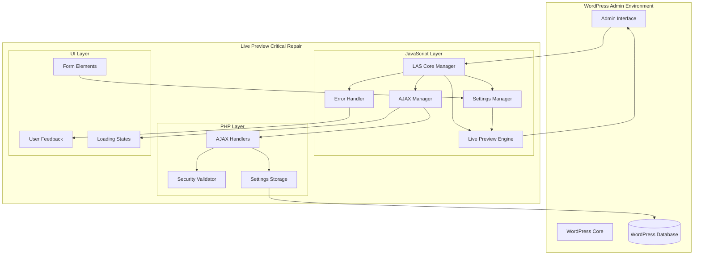
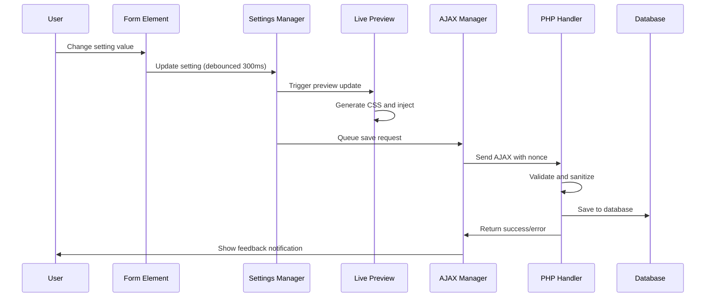

# Design Document

## Overview

The Live Preview Critical Repair implements a focused solution to restore the completely broken live preview functionality in Live Admin Styler v1.2.0. The design prioritizes immediate functionality restoration while maintaining compatibility with the existing codebase structure. The solution uses a lightweight, modular approach that can be implemented quickly and serves as a foundation for future enhancements.

## Architecture

### High-Level System Architecture



### Component Interaction Flow



## Components and Interfaces

### JavaScript Core Manager

**Purpose:** Central orchestrator that initializes and coordinates all live preview components.

```javascript
class LASCoreManager {
    constructor() {
        this.modules = new Map();
        this.config = window.lasConfig || {};
        this.initialized = false;
    }
    
    async init() {
        try {
            // Initialize core modules in dependency order
            this.modules.set('error', new ErrorHandler(this));
            this.modules.set('ajax', new AjaxManager(this));
            this.modules.set('settings', new SettingsManager(this));
            this.modules.set('preview', new LivePreviewEngine(this));
            
            // Bind form elements
            this.bindFormElements();
            
            // Initialize live preview
            await this.modules.get('preview').init();
            
            this.initialized = true;
            this.emit('core:ready');
            
        } catch (error) {
            this.modules.get('error').handleError(error);
        }
    }
    
    get(moduleName) {
        return this.modules.get(moduleName);
    }
    
    emit(event, data) {
        document.dispatchEvent(new CustomEvent(event, { detail: data }));
    }
}
```

**Key Features:**
- Centralized module management and initialization
- Event system for inter-module communication
- Error handling integration
- Configuration management
- Graceful initialization with error recovery

### Settings Manager

**Purpose:** Manages setting values, persistence, and synchronization across tabs.

```javascript
class SettingsManager {
    constructor(core) {
        this.core = core;
        this.settings = {};
        this.debounceTimers = new Map();
        this.localStorage = window.localStorage;
        this.broadcastChannel = null;
        
        this.initBroadcastChannel();
        this.loadSettings();
    }
    
    set(key, value, options = {}) {
        const { skipPreview = false, skipSave = false } = options;
        
        // Update local settings
        this.settings[key] = value;
        
        // Trigger live preview update
        if (!skipPreview) {
            this.core.get('preview').updateSetting(key, value);
        }
        
        // Debounced save to server
        if (!skipSave) {
            this.debouncedSave(key, value);
        }
        
        // Sync across tabs
        this.broadcastChange(key, value);
        
        // Store in localStorage as backup
        this.saveToLocalStorage();
        
        this.core.emit('settings:changed', { key, value });
    }
    
    get(key, defaultValue = null) {
        return this.settings[key] !== undefined ? this.settings[key] : defaultValue;
    }
    
    debouncedSave(key, value) {
        const timerId = `save_${key}`;
        
        // Clear existing timer
        if (this.debounceTimers.has(timerId)) {
            clearTimeout(this.debounceTimers.get(timerId));
        }
        
        // Set new timer
        const timer = setTimeout(() => {
            this.core.get('ajax').saveSettings({ [key]: value });
            this.debounceTimers.delete(timerId);
        }, 300);
        
        this.debounceTimers.set(timerId, timer);
    }
    
    initBroadcastChannel() {
        if ('BroadcastChannel' in window) {
            this.broadcastChannel = new BroadcastChannel('las-settings');
            this.broadcastChannel.onmessage = (event) => {
                const { key, value } = event.data;
                this.set(key, value, { skipSave: true });
            };
        }
    }
    
    broadcastChange(key, value) {
        if (this.broadcastChannel) {
            this.broadcastChannel.postMessage({ key, value });
        }
    }
}
```

**Key Features:**
- Debounced saving (300ms) to prevent excessive AJAX calls
- Multi-tab synchronization via BroadcastChannel API
- localStorage backup for offline persistence
- Event-driven architecture for loose coupling
- Graceful fallbacks for unsupported browsers

### Live Preview Engine

**Purpose:** Handles real-time CSS injection and DOM updates for live preview functionality.

```javascript
class LivePreviewEngine {
    constructor(core) {
        this.core = core;
        this.styleElement = null;
        this.cssCache = new Map();
        this.updateQueue = [];
        this.isProcessing = false;
    }
    
    async init() {
        this.createStyleElement();
        this.bindEvents();
        await this.loadInitialStyles();
    }
    
    createStyleElement() {
        this.styleElement = document.createElement('style');
        this.styleElement.id = 'las-live-preview-styles';
        this.styleElement.type = 'text/css';
        document.head.appendChild(this.styleElement);
    }
    
    updateSetting(key, value) {
        // Add to update queue
        this.updateQueue.push({ key, value, timestamp: Date.now() });
        
        // Process queue with debouncing
        this.processUpdateQueue();
    }
    
    processUpdateQueue() {
        if (this.isProcessing) return;
        
        this.isProcessing = true;
        
        // Use requestAnimationFrame for smooth updates
        requestAnimationFrame(() => {
            const updates = [...this.updateQueue];
            this.updateQueue = [];
            
            // Generate CSS for all updates
            const css = this.generateCSS(updates);
            
            // Apply CSS
            this.applyCSS(css);
            
            this.isProcessing = false;
            
            // Process any queued updates
            if (this.updateQueue.length > 0) {
                this.processUpdateQueue();
            }
        });
    }
    
    generateCSS(updates) {
        let css = '';
        
        for (const { key, value } of updates) {
            const cssRule = this.generateCSSRule(key, value);
            if (cssRule) {
                css += cssRule + '\n';
                this.cssCache.set(key, cssRule);
            }
        }
        
        return css;
    }
    
    generateCSSRule(key, value) {
        const cssMap = {
            'menu_background_color': `#adminmenu { background-color: ${value} !important; }`,
            'menu_text_color': `#adminmenu a { color: ${value} !important; }`,
            'adminbar_background': `#wpadminbar { background: ${value} !important; }`,
            'content_background': `#wpbody-content { background-color: ${value} !important; }`,
            // Add more mappings as needed
        };
        
        return cssMap[key] || null;
    }
    
    applyCSS(css) {
        if (this.styleElement) {
            this.styleElement.textContent = css;
        }
    }
}
```

**Key Features:**
- Efficient CSS injection with DOM manipulation
- Update queuing and batching for performance
- CSS caching to prevent redundant generation
- RequestAnimationFrame for smooth updates
- Extensible CSS rule mapping system

### AJAX Manager

**Purpose:** Handles all server communication with retry logic, error handling, and user feedback.

```javascript
class AjaxManager {
    constructor(core) {
        this.core = core;
        this.requestQueue = [];
        this.isProcessing = false;
        this.retryAttempts = new Map();
        this.maxRetries = 3;
        this.baseDelay = 1000; // 1 second base delay for exponential backoff
    }
    
    async saveSettings(settings) {
        const request = {
            id: this.generateRequestId(),
            action: 'las_save_settings',
            data: settings,
            nonce: this.core.config.nonce,
            timestamp: Date.now()
        };
        
        return this.queueRequest(request);
    }
    
    queueRequest(request) {
        return new Promise((resolve, reject) => {
            request.resolve = resolve;
            request.reject = reject;
            
            this.requestQueue.push(request);
            this.processQueue();
        });
    }
    
    async processQueue() {
        if (this.isProcessing || this.requestQueue.length === 0) return;
        
        this.isProcessing = true;
        
        while (this.requestQueue.length > 0) {
            const request = this.requestQueue.shift();
            
            try {
                const result = await this.executeRequest(request);
                request.resolve(result);
                
                // Reset retry count on success
                this.retryAttempts.delete(request.id);
                
            } catch (error) {
                await this.handleRequestError(request, error);
            }
        }
        
        this.isProcessing = false;
    }
    
    async executeRequest(request) {
        // Show loading indicator
        this.core.get('error').showLoading(true);
        
        const formData = new FormData();
        formData.append('action', request.action);
        formData.append('nonce', request.nonce);
        formData.append('settings', JSON.stringify(request.data));
        
        const response = await fetch(this.core.config.ajaxUrl, {
            method: 'POST',
            body: formData,
            credentials: 'same-origin',
            signal: AbortSignal.timeout(10000) // 10 second timeout
        });
        
        // Hide loading indicator
        this.core.get('error').showLoading(false);
        
        if (!response.ok) {
            throw new Error(`HTTP ${response.status}: ${response.statusText}`);
        }
        
        const result = await response.json();
        
        if (!result.success) {
            throw new Error(result.data || 'Unknown server error');
        }
        
        // Show success feedback
        this.core.get('error').showSuccess('Settings saved successfully');
        
        return result.data;
    }
    
    async handleRequestError(request, error) {
        const retryCount = this.retryAttempts.get(request.id) || 0;
        
        if (retryCount < this.maxRetries) {
            // Exponential backoff retry
            const delay = this.baseDelay * Math.pow(2, retryCount);
            this.retryAttempts.set(request.id, retryCount + 1);
            
            setTimeout(() => {
                this.requestQueue.unshift(request); // Add back to front of queue
                this.processQueue();
            }, delay);
            
            this.core.get('error').showWarning(`Request failed, retrying in ${delay/1000}s...`);
            
        } else {
            // Max retries exceeded
            this.retryAttempts.delete(request.id);
            this.core.get('error').showError(`Failed to save settings: ${error.message}`);
            request.reject(error);
        }
    }
    
    generateRequestId() {
        return `req_${Date.now()}_${Math.random().toString(36).substr(2, 9)}`;
    }
}
```

**Key Features:**
- Request queuing to prevent conflicts
- Exponential backoff retry logic (up to 3 attempts)
- Timeout handling (10 seconds)
- Loading states and user feedback
- Proper WordPress nonce handling
- Error recovery and graceful degradation

### Error Handler and User Feedback

**Purpose:** Provides comprehensive error handling and user feedback systems.

```javascript
class ErrorHandler {
    constructor(core) {
        this.core = core;
        this.notificationContainer = null;
        this.loadingIndicator = null;
        
        this.init();
    }
    
    init() {
        this.createNotificationContainer();
        this.createLoadingIndicator();
        this.bindGlobalErrorHandlers();
    }
    
    createNotificationContainer() {
        this.notificationContainer = document.createElement('div');
        this.notificationContainer.id = 'las-notifications';
        this.notificationContainer.className = 'las-notifications';
        document.body.appendChild(this.notificationContainer);
    }
    
    createLoadingIndicator() {
        this.loadingIndicator = document.createElement('div');
        this.loadingIndicator.id = 'las-loading';
        this.loadingIndicator.className = 'las-loading hidden';
        this.loadingIndicator.innerHTML = `
            <div class="las-spinner"></div>
            <span>Saving settings...</span>
        `;
        document.body.appendChild(this.loadingIndicator);
    }
    
    bindGlobalErrorHandlers() {
        window.addEventListener('error', (event) => {
            this.handleError(event.error);
        });
        
        window.addEventListener('unhandledrejection', (event) => {
            this.handleError(event.reason);
        });
    }
    
    handleError(error) {
        console.error('[LAS Error]:', error);
        
        // Log to server if possible
        this.logError(error);
        
        // Show user-friendly message
        this.showError('An unexpected error occurred. Please try again.');
    }
    
    showNotification(message, type = 'info', duration = 5000) {
        const notification = document.createElement('div');
        notification.className = `las-notification las-notification--${type}`;
        notification.innerHTML = `
            <div class="las-notification__content">
                <span class="las-notification__message">${message}</span>
                <button class="las-notification__close" aria-label="Close">&times;</button>
            </div>
        `;
        
        // Add close functionality
        notification.querySelector('.las-notification__close').addEventListener('click', () => {
            this.removeNotification(notification);
        });
        
        // Auto-remove after duration
        if (duration > 0) {
            setTimeout(() => {
                this.removeNotification(notification);
            }, duration);
        }
        
        this.notificationContainer.appendChild(notification);
        
        // Animate in
        requestAnimationFrame(() => {
            notification.classList.add('las-notification--visible');
        });
    }
    
    removeNotification(notification) {
        notification.classList.remove('las-notification--visible');
        setTimeout(() => {
            if (notification.parentNode) {
                notification.parentNode.removeChild(notification);
            }
        }, 300);
    }
    
    showSuccess(message) {
        this.showNotification(message, 'success');
    }
    
    showError(message) {
        this.showNotification(message, 'error', 0); // Don't auto-hide errors
    }
    
    showWarning(message) {
        this.showNotification(message, 'warning');
    }
    
    showLoading(show) {
        if (show) {
            this.loadingIndicator.classList.remove('hidden');
        } else {
            this.loadingIndicator.classList.add('hidden');
        }
    }
    
    async logError(error) {
        try {
            await fetch(this.core.config.ajaxUrl, {
                method: 'POST',
                headers: {
                    'Content-Type': 'application/x-www-form-urlencoded',
                },
                body: new URLSearchParams({
                    action: 'las_log_error',
                    nonce: this.core.config.nonce,
                    error: error.toString(),
                    stack: error.stack || '',
                    url: window.location.href,
                    userAgent: navigator.userAgent
                })
            });
        } catch (logError) {
            // Silently fail error logging to prevent infinite loops
            console.warn('Failed to log error to server:', logError);
        }
    }
}
```

**Key Features:**
- Toast-style notifications with auto-dismiss
- Loading indicators for async operations
- Global error capture and handling
- Server-side error logging
- Accessible UI with proper ARIA labels
- Smooth animations and transitions

## PHP Backend Components

### AJAX Handlers

**Purpose:** Secure server-side handling of AJAX requests with proper validation.

```php
<?php
class LAS_Ajax_Handlers {
    private $security;
    private $storage;
    
    public function __construct() {
        $this->security = new LAS_Security_Validator();
        $this->storage = new LAS_Settings_Storage();
        
        $this->register_handlers();
    }
    
    private function register_handlers() {
        add_action('wp_ajax_las_save_settings', [$this, 'handle_save_settings']);
        add_action('wp_ajax_las_load_settings', [$this, 'handle_load_settings']);
        add_action('wp_ajax_las_log_error', [$this, 'handle_log_error']);
    }
    
    public function handle_save_settings() {
        try {
            // Verify nonce
            if (!$this->security->verify_nonce($_POST['nonce'], 'las_ajax_nonce')) {
                wp_die('Security check failed', 'Unauthorized', ['response' => 403]);
            }
            
            // Check capabilities
            if (!current_user_can('manage_options')) {
                wp_die('Insufficient permissions', 'Forbidden', ['response' => 403]);
            }
            
            // Get and validate settings
            $settings = json_decode(stripslashes($_POST['settings']), true);
            if (json_last_error() !== JSON_ERROR_NONE) {
                wp_send_json_error('Invalid JSON data');
                return;
            }
            
            // Sanitize settings
            $sanitized_settings = $this->security->sanitize_settings($settings);
            
            // Save to database
            $result = $this->storage->save_settings($sanitized_settings);
            
            if ($result) {
                wp_send_json_success([
                    'message' => 'Settings saved successfully',
                    'timestamp' => current_time('timestamp')
                ]);
            } else {
                wp_send_json_error('Failed to save settings to database');
            }
            
        } catch (Exception $e) {
            error_log('[LAS] Save settings error: ' . $e->getMessage());
            wp_send_json_error('An unexpected error occurred');
        }
    }
    
    public function handle_load_settings() {
        try {
            // Verify nonce
            if (!$this->security->verify_nonce($_POST['nonce'], 'las_ajax_nonce')) {
                wp_die('Security check failed', 'Unauthorized', ['response' => 403]);
            }
            
            // Check capabilities
            if (!current_user_can('manage_options')) {
                wp_die('Insufficient permissions', 'Forbidden', ['response' => 403]);
            }
            
            // Load settings
            $settings = $this->storage->load_settings();
            
            wp_send_json_success([
                'settings' => $settings,
                'timestamp' => current_time('timestamp')
            ]);
            
        } catch (Exception $e) {
            error_log('[LAS] Load settings error: ' . $e->getMessage());
            wp_send_json_error('Failed to load settings');
        }
    }
    
    public function handle_log_error() {
        try {
            // Verify nonce
            if (!$this->security->verify_nonce($_POST['nonce'], 'las_ajax_nonce')) {
                return; // Silently fail for error logging
            }
            
            // Check capabilities
            if (!current_user_can('manage_options')) {
                return; // Silently fail for error logging
            }
            
            // Log error
            $error_data = [
                'error' => sanitize_text_field($_POST['error']),
                'stack' => sanitize_textarea_field($_POST['stack']),
                'url' => esc_url_raw($_POST['url']),
                'user_agent' => sanitize_text_field($_POST['userAgent']),
                'timestamp' => current_time('mysql'),
                'user_id' => get_current_user_id()
            ];
            
            error_log('[LAS Frontend Error] ' . json_encode($error_data));
            
            wp_send_json_success('Error logged');
            
        } catch (Exception $e) {
            // Silently fail error logging to prevent infinite loops
            error_log('[LAS] Error logging failed: ' . $e->getMessage());
        }
    }
}
```

### Security Validator

**Purpose:** Comprehensive input validation and sanitization for security.

```php
<?php
class LAS_Security_Validator {
    
    public function verify_nonce($nonce, $action) {
        return wp_verify_nonce($nonce, $action);
    }
    
    public function sanitize_settings($settings) {
        $sanitized = [];
        
        foreach ($settings as $key => $value) {
            $sanitized[$key] = $this->sanitize_setting_value($key, $value);
        }
        
        return $sanitized;
    }
    
    private function sanitize_setting_value($key, $value) {
        // Define sanitization rules for different setting types
        $sanitization_rules = [
            'color' => [$this, 'sanitize_color'],
            'css' => [$this, 'sanitize_css'],
            'text' => 'sanitize_text_field',
            'textarea' => 'sanitize_textarea_field',
            'number' => 'intval',
            'boolean' => 'boolval',
            'url' => 'esc_url_raw'
        ];
        
        // Determine setting type based on key
        $type = $this->get_setting_type($key);
        
        if (isset($sanitization_rules[$type])) {
            $sanitizer = $sanitization_rules[$type];
            
            if (is_callable($sanitizer)) {
                return call_user_func($sanitizer, $value);
            }
        }
        
        // Default sanitization
        return sanitize_text_field($value);
    }
    
    private function get_setting_type($key) {
        $type_map = [
            'background_color' => 'color',
            'text_color' => 'color',
            'custom_css' => 'css',
            'font_size' => 'number',
            'enable_feature' => 'boolean',
            'external_url' => 'url'
        ];
        
        // Check for patterns in key names
        if (strpos($key, '_color') !== false) return 'color';
        if (strpos($key, '_css') !== false) return 'css';
        if (strpos($key, '_url') !== false) return 'url';
        if (strpos($key, 'enable_') === 0) return 'boolean';
        
        return $type_map[$key] ?? 'text';
    }
    
    public function sanitize_color($color) {
        // Remove any whitespace
        $color = trim($color);
        
        // Validate hex color format
        if (preg_match('/^#([A-Fa-f0-9]{6}|[A-Fa-f0-9]{3})$/', $color)) {
            return $color;
        }
        
        // Validate RGB format
        if (preg_match('/^rgb\(\s*(\d+)\s*,\s*(\d+)\s*,\s*(\d+)\s*\)$/', $color, $matches)) {
            $r = min(255, max(0, intval($matches[1])));
            $g = min(255, max(0, intval($matches[2])));
            $b = min(255, max(0, intval($matches[3])));
            return "rgb($r, $g, $b)";
        }
        
        // Validate RGBA format
        if (preg_match('/^rgba\(\s*(\d+)\s*,\s*(\d+)\s*,\s*(\d+)\s*,\s*([\d.]+)\s*\)$/', $color, $matches)) {
            $r = min(255, max(0, intval($matches[1])));
            $g = min(255, max(0, intval($matches[2])));
            $b = min(255, max(0, intval($matches[3])));
            $a = min(1, max(0, floatval($matches[4])));
            return "rgba($r, $g, $b, $a)";
        }
        
        // Return default if invalid
        return '#000000';
    }
    
    public function sanitize_css($css) {
        // Remove potentially dangerous CSS
        $dangerous_patterns = [
            '/javascript\s*:/i',
            '/expression\s*\(/i',
            '/@import/i',
            '/behavior\s*:/i',
            '/-moz-binding/i',
            '/vbscript\s*:/i'
        ];
        
        foreach ($dangerous_patterns as $pattern) {
            $css = preg_replace($pattern, '', $css);
        }
        
        // Basic CSS validation - only allow safe properties
        $allowed_properties = [
            'color', 'background-color', 'background', 'font-size', 'font-family',
            'margin', 'padding', 'border', 'width', 'height', 'display',
            'position', 'top', 'left', 'right', 'bottom', 'z-index'
        ];
        
        // This is a simplified validation - in production, consider using a CSS parser
        return wp_strip_all_tags($css);
    }
}
```

### Settings Storage

**Purpose:** Efficient database operations for settings persistence.

```php
<?php
class LAS_Settings_Storage {
    private $option_prefix = 'las_';
    private $cache_group = 'las_settings';
    
    public function save_settings($settings) {
        $success = true;
        
        foreach ($settings as $key => $value) {
            $option_name = $this->option_prefix . $key;
            $result = update_option($option_name, $value);
            
            if (!$result && get_option($option_name) !== $value) {
                $success = false;
                error_log("[LAS] Failed to save setting: $key");
            }
            
            // Clear cache
            wp_cache_delete($option_name, $this->cache_group);
        }
        
        // Trigger action for other plugins/themes
        do_action('las_settings_saved', $settings);
        
        return $success;
    }
    
    public function load_settings() {
        $default_settings = $this->get_default_settings();
        $settings = [];
        
        foreach ($default_settings as $key => $default_value) {
            $option_name = $this->option_prefix . $key;
            
            // Try cache first
            $cached_value = wp_cache_get($option_name, $this->cache_group);
            if ($cached_value !== false) {
                $settings[$key] = $cached_value;
                continue;
            }
            
            // Load from database
            $value = get_option($option_name, $default_value);
            $settings[$key] = $value;
            
            // Cache the value
            wp_cache_set($option_name, $value, $this->cache_group, 3600);
        }
        
        return $settings;
    }
    
    private function get_default_settings() {
        return [
            'menu_background_color' => '#23282d',
            'menu_text_color' => '#ffffff',
            'menu_hover_color' => '#0073aa',
            'adminbar_background' => '#23282d',
            'content_background' => '#f1f1f1',
            'enable_live_preview' => true,
            'animation_speed' => 'normal'
        ];
    }
    
    public function reset_settings() {
        $default_settings = $this->get_default_settings();
        
        foreach ($default_settings as $key => $default_value) {
            $option_name = $this->option_prefix . $key;
            update_option($option_name, $default_value);
            wp_cache_delete($option_name, $this->cache_group);
        }
        
        do_action('las_settings_reset');
        
        return true;
    }
}
```

## Data Models

### Settings Data Structure

```javascript
const SettingsSchema = {
    // Menu customization
    menu_background_color: {
        type: 'color',
        default: '#23282d',
        cssTarget: '#adminmenu',
        cssProperty: 'background-color'
    },
    menu_text_color: {
        type: 'color',
        default: '#ffffff',
        cssTarget: '#adminmenu a',
        cssProperty: 'color'
    },
    menu_hover_color: {
        type: 'color',
        default: '#0073aa',
        cssTarget: '#adminmenu a:hover',
        cssProperty: 'color'
    },
    
    // Admin bar customization
    adminbar_background: {
        type: 'color',
        default: '#23282d',
        cssTarget: '#wpadminbar',
        cssProperty: 'background'
    },
    
    // Content area customization
    content_background: {
        type: 'color',
        default: '#f1f1f1',
        cssTarget: '#wpbody-content',
        cssProperty: 'background-color'
    },
    
    // System settings
    enable_live_preview: {
        type: 'boolean',
        default: true
    },
    animation_speed: {
        type: 'select',
        default: 'normal',
        options: ['slow', 'normal', 'fast']
    }
};
```

### User State Model

```javascript
const UserStateSchema = {
    activeTab: 'general',
    lastSaved: null,
    isDirty: false,
    recentColors: [],
    preferences: {
        showTooltips: true,
        autoSave: true,
        confirmReset: true
    }
};
```

## Error Handling Strategy

### Error Categories and Responses

1. **Network Errors**
   - Timeout errors → Retry with exponential backoff
   - Connection errors → Show offline message, queue requests
   - Server errors (5xx) → Retry up to 3 times, then show error

2. **Validation Errors**
   - Invalid input → Show field-specific error messages
   - Security violations → Log and show generic error
   - Permission errors → Show access denied message

3. **JavaScript Errors**
   - Syntax errors → Log and show generic error
   - Runtime errors → Attempt recovery, show user notification
   - Promise rejections → Handle gracefully with user feedback

4. **WordPress Integration Errors**
   - Plugin conflicts → Detect and provide guidance
   - Theme compatibility → Graceful degradation
   - Version incompatibility → Show upgrade notice

## Testing Strategy

### Unit Testing Approach

**JavaScript Testing (Jest):**
```javascript
describe('SettingsManager', () => {
    let settingsManager;
    let mockCore;
    
    beforeEach(() => {
        mockCore = {
            get: jest.fn(),
            emit: jest.fn(),
            config: { nonce: 'test-nonce' }
        };
        settingsManager = new SettingsManager(mockCore);
    });
    
    test('should debounce save operations', async () => {
        const mockAjax = { saveSettings: jest.fn() };
        mockCore.get.mockReturnValue(mockAjax);
        
        settingsManager.set('test_key', 'value1');
        settingsManager.set('test_key', 'value2');
        settingsManager.set('test_key', 'value3');
        
        // Wait for debounce
        await new Promise(resolve => setTimeout(resolve, 350));
        
        expect(mockAjax.saveSettings).toHaveBeenCalledTimes(1);
        expect(mockAjax.saveSettings).toHaveBeenCalledWith({ test_key: 'value3' });
    });
});
```

**PHP Testing (PHPUnit):**
```php
class LAS_Security_Validator_Test extends WP_UnitTestCase {
    private $validator;
    
    public function setUp(): void {
        parent::setUp();
        $this->validator = new LAS_Security_Validator();
    }
    
    public function test_sanitize_color_valid_hex() {
        $result = $this->validator->sanitize_color('#ff0000');
        $this->assertEquals('#ff0000', $result);
    }
    
    public function test_sanitize_color_invalid_input() {
        $result = $this->validator->sanitize_color('invalid-color');
        $this->assertEquals('#000000', $result);
    }
    
    public function test_sanitize_css_removes_dangerous_content() {
        $dangerous_css = 'color: red; javascript:alert("xss");';
        $result = $this->validator->sanitize_css($dangerous_css);
        $this->assertStringNotContainsString('javascript:', $result);
    }
}
```

### Integration Testing

**End-to-End Testing (Playwright):**
```javascript
test('live preview updates when color is changed', async ({ page }) => {
    await page.goto('/wp-admin/admin.php?page=live-admin-styler');
    
    // Wait for initialization
    await page.waitForSelector('#las-live-preview-styles');
    
    // Change menu background color
    await page.fill('#menu_background_color', '#ff0000');
    
    // Wait for debounced update
    await page.waitForTimeout(350);
    
    // Check that CSS was injected
    const styleContent = await page.textContent('#las-live-preview-styles');
    expect(styleContent).toContain('background-color: #ff0000');
    
    // Verify visual change
    const menuBgColor = await page.evaluate(() => {
        return getComputedStyle(document.querySelector('#adminmenu')).backgroundColor;
    });
    expect(menuBgColor).toBe('rgb(255, 0, 0)');
});
```

## Performance Optimization

### Memory Management
- Debounced operations to prevent excessive function calls
- CSS caching to avoid redundant generation
- Event listener cleanup on component destruction
- Request queuing to prevent memory leaks from concurrent requests

### DOM Optimization
- Single style element for all live preview CSS
- RequestAnimationFrame for smooth updates
- Batch DOM updates to minimize reflow/repaint
- Efficient CSS selectors for better performance

### Network Optimization
- Request deduplication and queuing
- Exponential backoff for failed requests
- Timeout handling to prevent hanging requests
- Compression and minification of payloads

This design provides a solid foundation for implementing the critical live preview repair while maintaining compatibility with the existing codebase and providing a path for future enhancements.