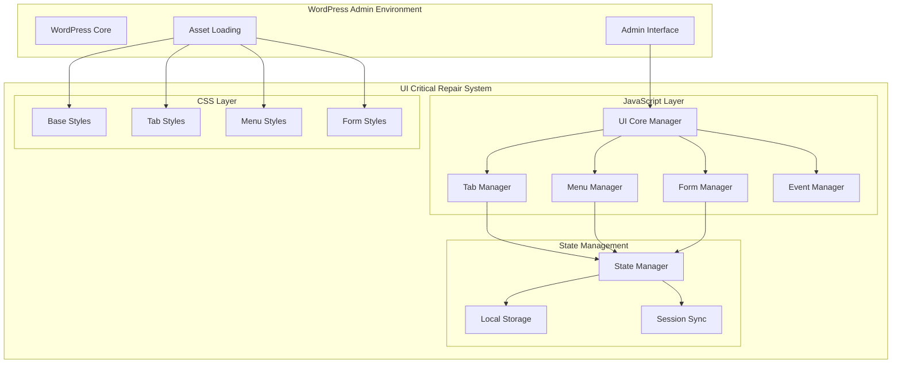
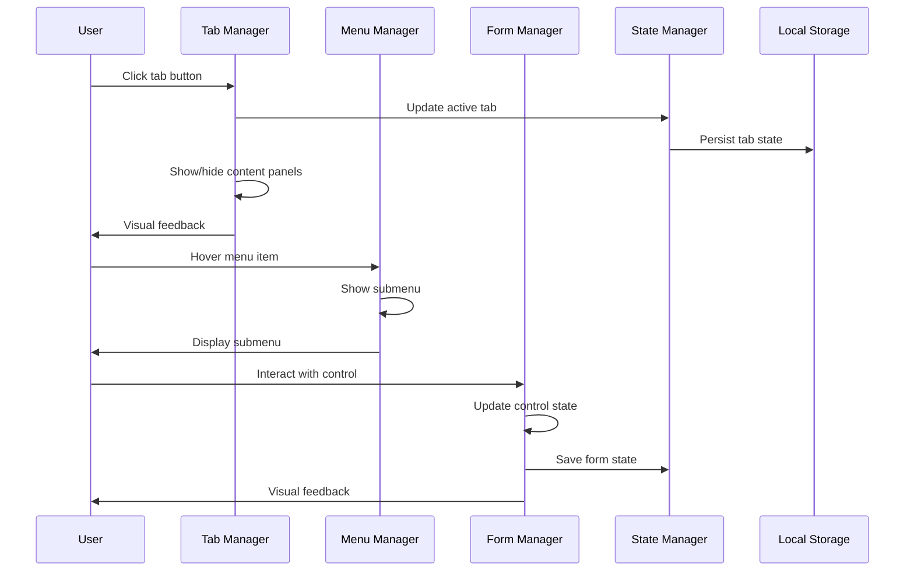

# Design Document

## Overview

The UI Functionality Critical Repair implements a focused solution to restore the completely broken user interface functionality in Live Admin Styler. The design prioritizes immediate UI restoration while maintaining compatibility with the existing codebase structure. The solution uses a lightweight, modular approach that can be implemented quickly and serves as a foundation for future enhancements.

## Architecture

### High-Level System Architecture



### Component Interaction Flow



## Components and Interfaces

### UI Core Manager

**Purpose:** Central orchestrator that initializes and coordinates all UI components.

```javascript
class LASUICoreManager {
    constructor() {
        this.components = new Map();
        this.initialized = false;
        this.config = window.lasAdminData || {};
        this.eventBus = new EventTarget();
    }
    
    async init() {
        try {
            console.log('LAS UI: Starting UI Core Manager initialization...');
            
            // Initialize components in dependency order
            await this.initializeComponent('state', LASStateManager);
            await this.initializeComponent('events', LASEventManager);
            await this.initializeComponent('tabs', LASTabManager);
            await this.initializeComponent('menu', LASMenuManager);
            await this.initializeComponent('forms', LASFormManager);
            
            // Bind global event listeners
            this.bindGlobalEvents();
            
            // Mark as initialized
            this.initialized = true;
            
            // Emit ready event
            this.emit('ui:ready');
            
            console.log('LAS UI: Core Manager initialization complete');
            
        } catch (error) {
            console.error('LAS UI: Core Manager initialization failed:', error);
            this.handleInitializationError(error);
        }
    }
    
    async initializeComponent(name, ComponentClass) {
        try {
            const component = new ComponentClass(this);
            await component.init();
            this.components.set(name, component);
            console.log(`LAS UI: ${name} component initialized`);
        } catch (error) {
            console.error(`LAS UI: Failed to initialize ${name} component:`, error);
            throw error;
        }
    }
    
    get(componentName) {
        return this.components.get(componentName);
    }
    
    emit(eventName, data = null) {
        const event = new CustomEvent(eventName, { detail: data });
        this.eventBus.dispatchEvent(event);
        document.dispatchEvent(event);
    }
    
    on(eventName, callback) {
        this.eventBus.addEventListener(eventName, callback);
    }
    
    handleInitializationError(error) {
        // Show user-friendly error message
        const errorDiv = document.createElement('div');
        errorDiv.className = 'las-ui-error notice notice-error';
        errorDiv.innerHTML = `
            <p><strong>Live Admin Styler UI Error:</strong> Failed to initialize interface. Please refresh the page.</p>
            <p><small>Error: ${error.message}</small></p>
        `;
        
        const container = document.querySelector('.las-fresh-settings-wrap') || document.body;
        container.insertBefore(errorDiv, container.firstChild);
    }
}
```

### Tab Manager

**Purpose:** Manages tab navigation, content switching, and state persistence.

```javascript
class LASTabManager {
    constructor(core) {
        this.core = core;
        this.activeTab = 'general';
        this.tabButtons = new Map();
        this.tabPanels = new Map();
        this.initialized = false;
    }
    
    async init() {
        try {
            console.log('LAS UI: Initializing Tab Manager...');
            
            // Find and register tab elements
            this.discoverTabElements();
            
            // Restore saved tab state
            await this.restoreTabState();
            
            // Bind tab events
            this.bindTabEvents();
            
            // Set initial active tab
            this.setActiveTab(this.activeTab, false);
            
            this.initialized = true;
            console.log('LAS UI: Tab Manager initialized successfully');
            
        } catch (error) {
            console.error('LAS UI: Tab Manager initialization failed:', error);
            throw error;
        }
    }
    
    discoverTabElements() {
        // Find tab buttons
        const tabButtons = document.querySelectorAll('.las-tab[data-tab]');
        tabButtons.forEach(button => {
            const tabId = button.dataset.tab;
            this.tabButtons.set(tabId, button);
        });
        
        // Find tab panels
        const tabPanels = document.querySelectorAll('.las-tab-panel[id^="las-tab-"]');
        tabPanels.forEach(panel => {
            const tabId = panel.id.replace('las-tab-', '');
            this.tabPanels.set(tabId, panel);
        });
        
        console.log(`LAS UI: Discovered ${this.tabButtons.size} tabs and ${this.tabPanels.size} panels`);
    }
    
    async restoreTabState() {
        const stateManager = this.core.get('state');
        if (stateManager) {
            const savedTab = await stateManager.get('activeTab');
            if (savedTab && this.tabButtons.has(savedTab)) {
                this.activeTab = savedTab;
            }
        }
    }
    
    bindTabEvents() {
        this.tabButtons.forEach((button, tabId) => {
            // Click event
            button.addEventListener('click', (e) => {
                e.preventDefault();
                this.setActiveTab(tabId);
            });
            
            // Keyboard events
            button.addEventListener('keydown', (e) => {
                if (e.key === 'Enter' || e.key === ' ') {
                    e.preventDefault();
                    this.setActiveTab(tabId);
                }
                
                // Arrow key navigation
                if (e.key === 'ArrowLeft' || e.key === 'ArrowRight') {
                    this.navigateWithArrows(e.key === 'ArrowRight' ? 1 : -1);
                }
            });
        });
    }
    
    setActiveTab(tabId, saveState = true) {
        if (!this.tabButtons.has(tabId) || !this.tabPanels.has(tabId)) {
            console.warn(`LAS UI: Tab ${tabId} not found`);
            return false;
        }
        
        // Update button states
        this.tabButtons.forEach((button, id) => {
            if (id === tabId) {
                button.classList.add('active');
                button.setAttribute('aria-selected', 'true');
                button.setAttribute('tabindex', '0');
            } else {
                button.classList.remove('active');
                button.setAttribute('aria-selected', 'false');
                button.setAttribute('tabindex', '-1');
            }
        });
        
        // Update panel visibility
        this.tabPanels.forEach((panel, id) => {
            if (id === tabId) {
                panel.classList.add('active');
                panel.setAttribute('aria-hidden', 'false');
            } else {
                panel.classList.remove('active');
                panel.setAttribute('aria-hidden', 'true');
            }
        });
        
        // Update container data attribute
        const container = document.querySelector('.las-tabs-container');
        if (container) {
            container.setAttribute('data-active-tab', tabId);
        }
        
        // Save state
        if (saveState) {
            const stateManager = this.core.get('state');
            if (stateManager) {
                stateManager.set('activeTab', tabId);
            }
        }
        
        // Update active tab
        this.activeTab = tabId;
        
        // Emit event
        this.core.emit('tab:changed', { tabId, previousTab: this.activeTab });
        
        console.log(`LAS UI: Switched to tab: ${tabId}`);
        return true;
    }
    
    navigateWithArrows(direction) {
        const tabIds = Array.from(this.tabButtons.keys());
        const currentIndex = tabIds.indexOf(this.activeTab);
        const newIndex = (currentIndex + direction + tabIds.length) % tabIds.length;
        const newTabId = tabIds[newIndex];
        
        this.setActiveTab(newTabId);
        this.tabButtons.get(newTabId).focus();
    }
    
    getActiveTab() {
        return this.activeTab;
    }
}
```

### Menu Manager

**Purpose:** Handles sidebar menu interactions, submenu display, and hover states.

```javascript
class LASMenuManager {
    constructor(core) {
        this.core = core;
        this.menuItems = new Map();
        this.submenus = new Map();
        this.hoverTimeout = null;
        this.hoverDelay = 300; // ms
    }
    
    async init() {
        try {
            console.log('LAS UI: Initializing Menu Manager...');
            
            // Discover menu elements
            this.discoverMenuElements();
            
            // Bind menu events
            this.bindMenuEvents();
            
            // Initialize submenu positioning
            this.initializeSubmenuPositioning();
            
            console.log('LAS UI: Menu Manager initialized successfully');
            
        } catch (error) {
            console.error('LAS UI: Menu Manager initialization failed:', error);
            throw error;
        }
    }
    
    discoverMenuElements() {
        // Find menu items with submenus
        const menuItems = document.querySelectorAll('.las-menu-item, .wp-menu-name');
        menuItems.forEach(item => {
            const submenu = item.nextElementSibling;
            if (submenu && submenu.classList.contains('wp-submenu')) {
                const itemId = item.id || `menu-${Date.now()}-${Math.random()}`;
                this.menuItems.set(itemId, item);
                this.submenus.set(itemId, submenu);
            }
        });
        
        console.log(`LAS UI: Discovered ${this.menuItems.size} menu items with submenus`);
    }
    
    bindMenuEvents() {
        this.menuItems.forEach((item, itemId) => {
            const submenu = this.submenus.get(itemId);
            
            // Mouse events
            item.addEventListener('mouseenter', () => {
                this.showSubmenu(itemId);
            });
            
            item.addEventListener('mouseleave', () => {
                this.scheduleHideSubmenu(itemId);
            });
            
            if (submenu) {
                submenu.addEventListener('mouseenter', () => {
                    this.cancelHideSubmenu();
                });
                
                submenu.addEventListener('mouseleave', () => {
                    this.scheduleHideSubmenu(itemId);
                });
            }
            
            // Click events for mobile
            item.addEventListener('click', (e) => {
                if (window.innerWidth <= 782) { // WordPress mobile breakpoint
                    e.preventDefault();
                    this.toggleSubmenu(itemId);
                }
            });
            
            // Keyboard events
            item.addEventListener('keydown', (e) => {
                if (e.key === 'Enter' || e.key === ' ') {
                    e.preventDefault();
                    this.toggleSubmenu(itemId);
                }
                
                if (e.key === 'ArrowDown' && submenu) {
                    e.preventDefault();
                    this.showSubmenu(itemId);
                    this.focusFirstSubmenuItem(itemId);
                }
            });
        });
    }
    
    showSubmenu(itemId) {
        const submenu = this.submenus.get(itemId);
        if (!submenu) return;
        
        // Cancel any pending hide
        this.cancelHideSubmenu();
        
        // Show submenu
        submenu.classList.add('las-submenu-visible');
        submenu.setAttribute('aria-hidden', 'false');
        
        // Position submenu
        this.positionSubmenu(itemId);
        
        // Emit event
        this.core.emit('menu:submenu-shown', { itemId });
    }
    
    hideSubmenu(itemId) {
        const submenu = this.submenus.get(itemId);
        if (!submenu) return;
        
        submenu.classList.remove('las-submenu-visible');
        submenu.setAttribute('aria-hidden', 'true');
        
        // Emit event
        this.core.emit('menu:submenu-hidden', { itemId });
    }
    
    toggleSubmenu(itemId) {
        const submenu = this.submenus.get(itemId);
        if (!submenu) return;
        
        if (submenu.classList.contains('las-submenu-visible')) {
            this.hideSubmenu(itemId);
        } else {
            this.showSubmenu(itemId);
        }
    }
    
    scheduleHideSubmenu(itemId) {
        this.cancelHideSubmenu();
        this.hoverTimeout = setTimeout(() => {
            this.hideSubmenu(itemId);
        }, this.hoverDelay);
    }
    
    cancelHideSubmenu() {
        if (this.hoverTimeout) {
            clearTimeout(this.hoverTimeout);
            this.hoverTimeout = null;
        }
    }
    
    positionSubmenu(itemId) {
        const item = this.menuItems.get(itemId);
        const submenu = this.submenus.get(itemId);
        if (!item || !submenu) return;
        
        const itemRect = item.getBoundingClientRect();
        const viewportHeight = window.innerHeight;
        
        // Reset positioning
        submenu.style.top = '';
        submenu.style.bottom = '';
        
        // Calculate optimal position
        const submenuHeight = submenu.offsetHeight;
        const spaceBelow = viewportHeight - itemRect.bottom;
        const spaceAbove = itemRect.top;
        
        if (spaceBelow >= submenuHeight || spaceBelow >= spaceAbove) {
            // Position below
            submenu.style.top = '0';
        } else {
            // Position above
            submenu.style.bottom = '0';
        }
    }
    
    focusFirstSubmenuItem(itemId) {
        const submenu = this.submenus.get(itemId);
        if (!submenu) return;
        
        const firstLink = submenu.querySelector('a');
        if (firstLink) {
            firstLink.focus();
        }
    }
    
    initializeSubmenuPositioning() {
        // Add CSS for submenu positioning
        const style = document.createElement('style');
        style.textContent = `
            .las-submenu-visible {
                display: block !important;
                opacity: 1 !important;
                visibility: visible !important;
            }
            
            .wp-submenu {
                transition: opacity 0.2s ease, visibility 0.2s ease;
            }
            
            .wp-submenu:not(.las-submenu-visible) {
                opacity: 0;
                visibility: hidden;
            }
        `;
        document.head.appendChild(style);
    }
}
```

### Form Manager

**Purpose:** Manages form controls, validation, and user interactions.

```javascript
class LASFormManager {
    constructor(core) {
        this.core = core;
        this.controls = new Map();
        this.validators = new Map();
        this.initialized = false;
    }
    
    async init() {
        try {
            console.log('LAS UI: Initializing Form Manager...');
            
            // Discover form controls
            this.discoverFormControls();
            
            // Initialize control types
            this.initializeColorPickers();
            this.initializeSliders();
            this.initializeTextInputs();
            this.initializeToggles();
            this.initializeDropdowns();
            
            // Bind form events
            this.bindFormEvents();
            
            this.initialized = true;
            console.log('LAS UI: Form Manager initialized successfully');
            
        } catch (error) {
            console.error('LAS UI: Form Manager initialization failed:', error);
            throw error;
        }
    }
    
    discoverFormControls() {
        const selectors = [
            'input[type="color"]',
            'input[type="range"]',
            'input[type="text"]',
            'input[type="number"]',
            'input[type="checkbox"]',
            'select',
            'textarea',
            '.las-color-picker',
            '.las-slider',
            '.las-toggle'
        ];
        
        selectors.forEach(selector => {
            const elements = document.querySelectorAll(selector);
            elements.forEach(element => {
                const controlId = element.id || element.name || `control-${Date.now()}-${Math.random()}`;
                this.controls.set(controlId, {
                    element,
                    type: this.getControlType(element),
                    value: this.getControlValue(element)
                });
            });
        });
        
        console.log(`LAS UI: Discovered ${this.controls.size} form controls`);
    }
    
    getControlType(element) {
        if (element.type === 'color' || element.classList.contains('las-color-picker')) {
            return 'color';
        }
        if (element.type === 'range' || element.classList.contains('las-slider')) {
            return 'slider';
        }
        if (element.type === 'checkbox' || element.classList.contains('las-toggle')) {
            return 'toggle';
        }
        if (element.tagName === 'SELECT') {
            return 'dropdown';
        }
        return 'text';
    }
    
    getControlValue(element) {
        if (element.type === 'checkbox') {
            return element.checked;
        }
        return element.value;
    }
    
    initializeColorPickers() {
        this.controls.forEach((control, controlId) => {
            if (control.type === 'color') {
                this.initializeColorPicker(controlId, control);
            }
        });
    }
    
    initializeColorPicker(controlId, control) {
        const element = control.element;
        
        // Initialize WordPress color picker if available
        if (jQuery && jQuery.fn.wpColorPicker) {
            jQuery(element).wpColorPicker({
                change: (event, ui) => {
                    this.handleControlChange(controlId, ui.color.toString());
                },
                clear: () => {
                    this.handleControlChange(controlId, '');
                }
            });
        } else {
            // Fallback to native color input
            element.addEventListener('change', (e) => {
                this.handleControlChange(controlId, e.target.value);
            });
            
            element.addEventListener('input', (e) => {
                this.handleControlChange(controlId, e.target.value, { skipSave: true });
            });
        }
    }
    
    initializeSliders() {
        this.controls.forEach((control, controlId) => {
            if (control.type === 'slider') {
                this.initializeSlider(controlId, control);
            }
        });
    }
    
    initializeSlider(controlId, control) {
        const element = control.element;
        
        // Initialize jQuery UI slider if available
        if (jQuery && jQuery.fn.slider) {
            const $element = jQuery(element);
            const min = parseFloat(element.min) || 0;
            const max = parseFloat(element.max) || 100;
            const step = parseFloat(element.step) || 1;
            const value = parseFloat(element.value) || min;
            
            // Create slider container if it doesn't exist
            let sliderContainer = element.nextElementSibling;
            if (!sliderContainer || !sliderContainer.classList.contains('las-slider-ui')) {
                sliderContainer = document.createElement('div');
                sliderContainer.className = 'las-slider-ui';
                element.parentNode.insertBefore(sliderContainer, element.nextSibling);
            }
            
            // Initialize jQuery UI slider
            jQuery(sliderContainer).slider({
                min: min,
                max: max,
                step: step,
                value: value,
                slide: (event, ui) => {
                    element.value = ui.value;
                    this.handleControlChange(controlId, ui.value, { skipSave: true });
                },
                change: (event, ui) => {
                    element.value = ui.value;
                    this.handleControlChange(controlId, ui.value);
                }
            });
            
            // Hide original input
            element.style.display = 'none';
            
        } else {
            // Fallback to native range input
            element.addEventListener('input', (e) => {
                this.handleControlChange(controlId, e.target.value, { skipSave: true });
            });
            
            element.addEventListener('change', (e) => {
                this.handleControlChange(controlId, e.target.value);
            });
        }
    }
    
    initializeTextInputs() {
        this.controls.forEach((control, controlId) => {
            if (control.type === 'text') {
                this.initializeTextInput(controlId, control);
            }
        });
    }
    
    initializeTextInput(controlId, control) {
        const element = control.element;
        let debounceTimer;
        
        element.addEventListener('input', (e) => {
            // Clear existing timer
            if (debounceTimer) {
                clearTimeout(debounceTimer);
            }
            
            // Set new timer for debounced update
            debounceTimer = setTimeout(() => {
                this.handleControlChange(controlId, e.target.value);
            }, 300);
        });
        
        element.addEventListener('blur', (e) => {
            // Immediate update on blur
            if (debounceTimer) {
                clearTimeout(debounceTimer);
            }
            this.handleControlChange(controlId, e.target.value);
        });
    }
    
    initializeToggles() {
        this.controls.forEach((control, controlId) => {
            if (control.type === 'toggle') {
                this.initializeToggle(controlId, control);
            }
        });
    }
    
    initializeToggle(controlId, control) {
        const element = control.element;
        
        element.addEventListener('change', (e) => {
            this.handleControlChange(controlId, e.target.checked);
        });
    }
    
    initializeDropdowns() {
        this.controls.forEach((control, controlId) => {
            if (control.type === 'dropdown') {
                this.initializeDropdown(controlId, control);
            }
        });
    }
    
    initializeDropdown(controlId, control) {
        const element = control.element;
        
        element.addEventListener('change', (e) => {
            this.handleControlChange(controlId, e.target.value);
        });
    }
    
    bindFormEvents() {
        // Global form submission handling
        const form = document.getElementById('las-fresh-settings-form');
        if (form) {
            form.addEventListener('submit', (e) => {
                this.handleFormSubmit(e);
            });
        }
    }
    
    handleControlChange(controlId, value, options = {}) {
        const control = this.controls.get(controlId);
        if (!control) return;
        
        // Update control value
        control.value = value;
        
        // Emit change event
        this.core.emit('form:control-changed', {
            controlId,
            value,
            type: control.type,
            options
        });
        
        // Save to state if not skipped
        if (!options.skipSave) {
            const stateManager = this.core.get('state');
            if (stateManager) {
                stateManager.set(`form.${controlId}`, value);
            }
        }
        
        console.log(`LAS UI: Control ${controlId} changed to:`, value);
    }
    
    handleFormSubmit(e) {
        // Add loading state
        const submitButton = e.target.querySelector('button[type="submit"]');
        if (submitButton) {
            submitButton.classList.add('las-button-loading');
            submitButton.disabled = true;
        }
        
        // Emit form submit event
        this.core.emit('form:submit', { form: e.target });
    }
    
    getControlValue(controlId) {
        const control = this.controls.get(controlId);
        return control ? control.value : null;
    }
    
    setControlValue(controlId, value) {
        const control = this.controls.get(controlId);
        if (!control) return false;
        
        const element = control.element;
        
        if (control.type === 'toggle') {
            element.checked = Boolean(value);
        } else {
            element.value = value;
        }
        
        // Update internal value
        control.value = value;
        
        // Trigger change event
        element.dispatchEvent(new Event('change', { bubbles: true }));
        
        return true;
    }
}
```

### State Manager

**Purpose:** Manages UI state persistence, synchronization, and restoration.

```javascript
class LASStateManager {
    constructor(core) {
        this.core = core;
        this.state = {};
        this.localStorage = window.localStorage;
        this.sessionStorage = window.sessionStorage;
        this.broadcastChannel = null;
        this.storageKey = 'las_ui_state';
        this.sessionKey = 'las_session_state';
    }
    
    async init() {
        try {
            console.log('LAS UI: Initializing State Manager...');
            
            // Initialize broadcast channel for multi-tab sync
            this.initializeBroadcastChannel();
            
            // Load saved state
            await this.loadState();
            
            // Bind storage events
            this.bindStorageEvents();
            
            console.log('LAS UI: State Manager initialized successfully');
            
        } catch (error) {
            console.error('LAS UI: State Manager initialization failed:', error);
            throw error;
        }
    }
    
    initializeBroadcastChannel() {
        if ('BroadcastChannel' in window) {
            this.broadcastChannel = new BroadcastChannel('las-ui-state');
            this.broadcastChannel.onmessage = (event) => {
                this.handleBroadcastMessage(event.data);
            };
        }
    }
    
    async loadState() {
        try {
            // Load from localStorage
            const savedState = this.localStorage.getItem(this.storageKey);
            if (savedState) {
                this.state = JSON.parse(savedState);
            }
            
            // Merge with session state
            const sessionState = this.sessionStorage.getItem(this.sessionKey);
            if (sessionState) {
                const parsed = JSON.parse(sessionState);
                this.state = { ...this.state, ...parsed };
            }
            
            console.log('LAS UI: State loaded:', this.state);
            
        } catch (error) {
            console.error('LAS UI: Failed to load state:', error);
            this.state = {};
        }
    }
    
    async saveState() {
        try {
            const stateJson = JSON.stringify(this.state);
            
            // Save to localStorage
            this.localStorage.setItem(this.storageKey, stateJson);
            
            // Save to sessionStorage
            this.sessionStorage.setItem(this.sessionKey, stateJson);
            
            // Broadcast to other tabs
            if (this.broadcastChannel) {
                this.broadcastChannel.postMessage({
                    type: 'state-update',
                    state: this.state,
                    timestamp: Date.now()
                });
            }
            
        } catch (error) {
            console.error('LAS UI: Failed to save state:', error);
        }
    }
    
    get(key, defaultValue = null) {
        const keys = key.split('.');
        let value = this.state;
        
        for (const k of keys) {
            if (value && typeof value === 'object' && k in value) {
                value = value[k];
            } else {
                return defaultValue;
            }
        }
        
        return value;
    }
    
    set(key, value) {
        const keys = key.split('.');
        let current = this.state;
        
        // Navigate to the parent object
        for (let i = 0; i < keys.length - 1; i++) {
            const k = keys[i];
            if (!(k in current) || typeof current[k] !== 'object') {
                current[k] = {};
            }
            current = current[k];
        }
        
        // Set the value
        current[keys[keys.length - 1]] = value;
        
        // Save state
        this.saveState();
        
        // Emit change event
        this.core.emit('state:changed', { key, value });
    }
    
    remove(key) {
        const keys = key.split('.');
        let current = this.state;
        
        // Navigate to the parent object
        for (let i = 0; i < keys.length - 1; i++) {
            const k = keys[i];
            if (!(k in current) || typeof current[k] !== 'object') {
                return false;
            }
            current = current[k];
        }
        
        // Remove the key
        delete current[keys[keys.length - 1]];
        
        // Save state
        this.saveState();
        
        return true;
    }
    
    clear() {
        this.state = {};
        this.saveState();
        this.core.emit('state:cleared');
    }
    
    handleBroadcastMessage(data) {
        if (data.type === 'state-update') {
            // Merge received state
            this.state = { ...this.state, ...data.state };
            
            // Emit sync event
            this.core.emit('state:synced', { state: data.state });
        }
    }
    
    bindStorageEvents() {
        // Listen for storage changes from other tabs
        window.addEventListener('storage', (e) => {
            if (e.key === this.storageKey && e.newValue) {
                try {
                    const newState = JSON.parse(e.newValue);
                    this.state = newState;
                    this.core.emit('state:external-change', { state: newState });
                } catch (error) {
                    console.error('LAS UI: Failed to parse external state change:', error);
                }
            }
        });
    }
    
    export() {
        return {
            state: this.state,
            timestamp: Date.now(),
            version: this.core.config.plugin_version || '1.0.0'
        };
    }
    
    import(data) {
        if (data && data.state) {
            this.state = data.state;
            this.saveState();
            this.core.emit('state:imported', { data });
            return true;
        }
        return false;
    }
}
```

### Event Manager

**Purpose:** Manages global event handling, delegation, and cleanup.

```javascript
class LASEventManager {
    constructor(core) {
        this.core = core;
        this.listeners = new Map();
        this.delegatedEvents = new Map();
        this.initialized = false;
    }
    
    async init() {
        try {
            console.log('LAS UI: Initializing Event Manager...');
            
            // Set up global event delegation
            this.setupEventDelegation();
            
            // Bind global events
            this.bindGlobalEvents();
            
            this.initialized = true;
            console.log('LAS UI: Event Manager initialized successfully');
            
        } catch (error) {
            console.error('LAS UI: Event Manager initialization failed:', error);
            throw error;
        }
    }
    
    setupEventDelegation() {
        const events = ['click', 'change', 'input', 'focus', 'blur', 'keydown'];
        
        events.forEach(eventType => {
            document.addEventListener(eventType, (e) => {
                this.handleDelegatedEvent(eventType, e);
            }, true);
        });
    }
    
    handleDelegatedEvent(eventType, event) {
        const target = event.target;
        const delegatedHandlers = this.delegatedEvents.get(eventType);
        
        if (!delegatedHandlers) return;
        
        delegatedHandlers.forEach(({ selector, handler }) => {
            if (target.matches(selector)) {
                handler(event);
            }
        });
    }
    
    on(selector, eventType, handler) {
        if (!this.delegatedEvents.has(eventType)) {
            this.delegatedEvents.set(eventType, []);
        }
        
        this.delegatedEvents.get(eventType).push({ selector, handler });
    }
    
    off(selector, eventType, handler) {
        const handlers = this.delegatedEvents.get(eventType);
        if (!handlers) return;
        
        const index = handlers.findIndex(h => 
            h.selector === selector && h.handler === handler
        );
        
        if (index !== -1) {
            handlers.splice(index, 1);
        }
    }
    
    bindGlobalEvents() {
        // Window resize
        window.addEventListener('resize', this.debounce(() => {
            this.core.emit('window:resize', {
                width: window.innerWidth,
                height: window.innerHeight
            });
        }, 250));
        
        // Page visibility
        document.addEventListener('visibilitychange', () => {
            this.core.emit('page:visibility-change', {
                hidden: document.hidden
            });
        });
        
        // Before unload
        window.addEventListener('beforeunload', () => {
            this.core.emit('page:before-unload');
            this.cleanup();
        });
    }
    
    debounce(func, wait) {
        let timeout;
        return function executedFunction(...args) {
            const later = () => {
                clearTimeout(timeout);
                func(...args);
            };
            clearTimeout(timeout);
            timeout = setTimeout(later, wait);
        };
    }
    
    cleanup() {
        // Clear all listeners
        this.listeners.clear();
        this.delegatedEvents.clear();
        
        // Close broadcast channel
        if (this.broadcastChannel) {
            this.broadcastChannel.close();
        }
    }
}
```

## CSS Architecture

### Base Styles

```css
/* Base UI Styles for Critical Repair */
.las-fresh-settings-wrap {
    font-family: -apple-system, BlinkMacSystemFont, "Segoe UI", Roboto, sans-serif;
    line-height: 1.4;
}

/* Tab Navigation Styles */
.las-tabs {
    display: flex;
    border-bottom: 1px solid #ddd;
    background: #fff;
    margin: 0;
    padding: 0;
}

.las-tab {
    background: none;
    border: none;
    padding: 12px 20px;
    cursor: pointer;
    border-bottom: 3px solid transparent;
    transition: all 0.2s ease;
    display: flex;
    align-items: center;
    gap: 8px;
    font-size: 14px;
    color: #555;
}

.las-tab:hover {
    background: #f8f9fa;
    color: #333;
}

.las-tab.active {
    color: #0073aa;
    border-bottom-color: #0073aa;
    background: #fff;
}

.las-tab:focus {
    outline: 2px solid #0073aa;
    outline-offset: -2px;
}

/* Tab Panel Styles */
.las-tab-panel {
    display: none;
    padding: 20px 0;
}

.las-tab-panel.active {
    display: block;
}

/* Menu Styles */
.las-submenu-visible {
    display: block !important;
    opacity: 1 !important;
    visibility: visible !important;
}

.wp-submenu {
    transition: opacity 0.2s ease, visibility 0.2s ease;
}

.wp-submenu:not(.las-submenu-visible) {
    opacity: 0;
    visibility: hidden;
}

/* Form Control Styles */
.las-slider-ui {
    margin: 10px 0;
    height: 6px;
    background: #ddd;
    border-radius: 3px;
    position: relative;
}

.las-slider-ui .ui-slider-handle {
    width: 18px;
    height: 18px;
    border-radius: 50%;
    background: #0073aa;
    border: 2px solid #fff;
    box-shadow: 0 2px 4px rgba(0,0,0,0.2);
    cursor: pointer;
    top: -6px;
}

.las-slider-ui .ui-slider-handle:focus {
    outline: 2px solid #0073aa;
    outline-offset: 2px;
}

/* Color Picker Styles */
.wp-color-picker {
    width: 60px;
    height: 30px;
    border: 1px solid #ddd;
    border-radius: 3px;
    cursor: pointer;
}

/* Loading States */
.las-button-loading {
    position: relative;
    color: transparent !important;
}

.las-button-loading::after {
    content: '';
    position: absolute;
    top: 50%;
    left: 50%;
    width: 16px;
    height: 16px;
    margin: -8px 0 0 -8px;
    border: 2px solid #fff;
    border-top-color: transparent;
    border-radius: 50%;
    animation: las-spin 1s linear infinite;
}

@keyframes las-spin {
    to { transform: rotate(360deg); }
}

/* Error States */
.las-ui-error {
    margin: 20px 0;
    padding: 15px;
    background: #fff;
    border-left: 4px solid #dc3232;
    box-shadow: 0 1px 3px rgba(0,0,0,0.1);
}

/* Responsive Design */
@media (max-width: 782px) {
    .las-tabs {
        flex-direction: column;
    }
    
    .las-tab {
        border-bottom: 1px solid #ddd;
        border-right: none;
    }
    
    .las-tab.active {
        border-bottom-color: #ddd;
        border-left: 3px solid #0073aa;
    }
}

/* Accessibility Improvements */
.las-tab[aria-selected="true"] {
    font-weight: 600;
}

.las-tab-panel[aria-hidden="true"] {
    display: none;
}

/* Focus Management */
.las-tab:focus-visible {
    outline: 2px solid #0073aa;
    outline-offset: -2px;
}

/* High Contrast Mode Support */
@media (prefers-contrast: high) {
    .las-tab.active {
        border-bottom-width: 4px;
    }
    
    .las-tab:focus {
        outline-width: 3px;
    }
}

/* Reduced Motion Support */
@media (prefers-reduced-motion: reduce) {
    .las-tab,
    .wp-submenu,
    .las-slider-ui .ui-slider-handle {
        transition: none;
    }
    
    .las-button-loading::after {
        animation: none;
    }
}
```

## Error Handling and Recovery

### Graceful Degradation Strategy

```javascript
class LASGracefulDegradation {
    constructor() {
        this.fallbacksApplied = new Set();
        this.criticalErrors = [];
    }
    
    handleComponentFailure(componentName, error) {
        console.error(`LAS UI: Component ${componentName} failed:`, error);
        
        // Apply appropriate fallback
        switch (componentName) {
            case 'tabs':
                this.applyTabFallback();
                break;
            case 'menu':
                this.applyMenuFallback();
                break;
            case 'forms':
                this.applyFormFallback();
                break;
            default:
                this.applyGenericFallback(componentName);
        }
        
        // Track critical errors
        this.criticalErrors.push({
            component: componentName,
            error: error.message,
            timestamp: Date.now()
        });
        
        // Show user notification
        this.showFallbackNotification(componentName);
    }
    
    applyTabFallback() {
        if (this.fallbacksApplied.has('tabs')) return;
        
        // Show all tab panels
        const panels = document.querySelectorAll('.las-tab-panel');
        panels.forEach(panel => {
            panel.style.display = 'block';
            panel.classList.add('las-fallback-visible');
        });
        
        // Add fallback styles
        const style = document.createElement('style');
        style.textContent = `
            .las-fallback-visible {
                border: 1px solid #ddd;
                margin-bottom: 20px;
                padding: 20px;
            }
            .las-fallback-visible::before {
                content: attr(aria-labelledby);
                display: block;
                font-weight: bold;
                margin-bottom: 15px;
                text-transform: capitalize;
            }
        `;
        document.head.appendChild(style);
        
        this.fallbacksApplied.add('tabs');
    }
    
    applyMenuFallback() {
        if (this.fallbacksApplied.has('menu')) return;
        
        // Make all submenus visible
        const submenus = document.querySelectorAll('.wp-submenu');
        submenus.forEach(submenu => {
            submenu.style.display = 'block';
            submenu.style.position = 'static';
            submenu.style.opacity = '1';
            submenu.style.visibility = 'visible';
        });
        
        this.fallbacksApplied.add('menu');
    }
    
    applyFormFallback() {
        if (this.fallbacksApplied.has('forms')) return;
        
        // Ensure all form controls are functional
        const controls = document.querySelectorAll('input, select, textarea');
        controls.forEach(control => {
            // Remove any disabled states
            control.disabled = false;
            
            // Add basic change handlers
            control.addEventListener('change', function() {
                this.setAttribute('data-changed', 'true');
            });
        });
        
        this.fallbacksApplied.add('forms');
    }
    
    showFallbackNotification(componentName) {
        const notification = document.createElement('div');
        notification.className = 'notice notice-warning las-fallback-notice';
        notification.innerHTML = `
            <p><strong>Notice:</strong> The ${componentName} component encountered an issue and is running in fallback mode. Functionality may be limited but the interface remains usable.</p>
        `;
        
        const container = document.querySelector('.las-fresh-settings-wrap');
        if (container) {
            container.insertBefore(notification, container.firstChild);
        }
    }
}
```

## Performance Optimization

### Lazy Loading and Code Splitting

```javascript
class LASPerformanceOptimizer {
    constructor() {
        this.loadedModules = new Set();
        this.performanceMetrics = {};
    }
    
    async loadModuleOnDemand(moduleName) {
        if (this.loadedModules.has(moduleName)) {
            return true;
        }
        
        const startTime = performance.now();
        
        try {
            // Dynamic import based on module name
            const module = await this.importModule(moduleName);
            
            // Track loading time
            const loadTime = performance.now() - startTime;
            this.performanceMetrics[moduleName] = {
                loadTime,
                timestamp: Date.now()
            };
            
            this.loadedModules.add(moduleName);
            console.log(`LAS UI: Module ${moduleName} loaded in ${loadTime.toFixed(2)}ms`);
            
            return module;
            
        } catch (error) {
            console.error(`LAS UI: Failed to load module ${moduleName}:`, error);
            return null;
        }
    }
    
    async importModule(moduleName) {
        // Module loading logic based on availability
        switch (moduleName) {
            case 'colorPicker':
                return this.loadColorPickerModule();
            case 'slider':
                return this.loadSliderModule();
            case 'advanced':
                return this.loadAdvancedModule();
            default:
                throw new Error(`Unknown module: ${moduleName}`);
        }
    }
    
    async loadColorPickerModule() {
        // Load WordPress color picker if not already loaded
        if (!window.jQuery || !window.jQuery.fn.wpColorPicker) {
            await this.loadScript('wp-color-picker');
        }
        return { loaded: true, type: 'colorPicker' };
    }
    
    async loadSliderModule() {
        // Load jQuery UI slider if not already loaded
        if (!window.jQuery || !window.jQuery.fn.slider) {
            await this.loadScript('jquery-ui-slider');
        }
        return { loaded: true, type: 'slider' };
    }
    
    loadScript(handle) {
        return new Promise((resolve, reject) => {
            if (document.querySelector(`script[data-handle="${handle}"]`)) {
                resolve();
                return;
            }
            
            // Trigger WordPress script loading
            if (window.wp && window.wp.hooks) {
                window.wp.hooks.doAction('las.load_script', handle);
            }
            
            // Fallback timeout
            setTimeout(resolve, 1000);
        });
    }
    
    getPerformanceReport() {
        return {
            loadedModules: Array.from(this.loadedModules),
            metrics: this.performanceMetrics,
            totalModules: this.loadedModules.size,
            averageLoadTime: this.calculateAverageLoadTime()
        };
    }
    
    calculateAverageLoadTime() {
        const times = Object.values(this.performanceMetrics).map(m => m.loadTime);
        return times.length > 0 ? times.reduce((a, b) => a + b, 0) / times.length : 0;
    }
}
```

## Testing Strategy

### Unit Testing Framework

```javascript
class LASUITester {
    constructor() {
        this.tests = [];
        this.results = [];
    }
    
    addTest(name, testFunction) {
        this.tests.push({ name, testFunction });
    }
    
    async runAllTests() {
        console.log('LAS UI: Running UI tests...');
        
        for (const test of this.tests) {
            try {
                const startTime = performance.now();
                await test.testFunction();
                const duration = performance.now() - startTime;
                
                this.results.push({
                    name: test.name,
                    status: 'passed',
                    duration
                });
                
                console.log(`✓ ${test.name} (${duration.toFixed(2)}ms)`);
                
            } catch (error) {
                this.results.push({
                    name: test.name,
                    status: 'failed',
                    error: error.message
                });
                
                console.error(`✗ ${test.name}: ${error.message}`);
            }
        }
        
        return this.getTestReport();
    }
    
    getTestReport() {
        const passed = this.results.filter(r => r.status === 'passed').length;
        const failed = this.results.filter(r => r.status === 'failed').length;
        
        return {
            total: this.results.length,
            passed,
            failed,
            results: this.results
        };
    }
}

// Example tests
const uiTester = new LASUITester();

uiTester.addTest('Tab Navigation', async () => {
    const tabButton = document.querySelector('.las-tab[data-tab="menu"]');
    const tabPanel = document.querySelector('#las-tab-menu');
    
    if (!tabButton || !tabPanel) {
        throw new Error('Tab elements not found');
    }
    
    // Simulate click
    tabButton.click();
    
    // Wait for transition
    await new Promise(resolve => setTimeout(resolve, 100));
    
    if (!tabButton.classList.contains('active')) {
        throw new Error('Tab button not activated');
    }
    
    if (!tabPanel.classList.contains('active')) {
        throw new Error('Tab panel not shown');
    }
});

uiTester.addTest('Form Control Interaction', async () => {
    const colorInput = document.querySelector('input[type="color"]');
    
    if (!colorInput) {
        throw new Error('Color input not found');
    }
    
    const originalValue = colorInput.value;
    colorInput.value = '#ff0000';
    colorInput.dispatchEvent(new Event('change', { bubbles: true }));
    
    if (colorInput.value !== '#ff0000') {
        throw new Error('Color input value not updated');
    }
});
```

## Deployment and Integration

### WordPress Integration Points

```php
<?php
/**
 * UI Critical Repair Integration
 */

// Enqueue UI repair assets
function las_ui_repair_enqueue_assets($hook_suffix) {
    if (!las_fresh_is_plugin_admin_page($hook_suffix)) {
        return;
    }
    
    // Enqueue core UI repair script
    wp_enqueue_script(
        'las-ui-repair',
        plugin_dir_url(__FILE__) . 'assets/js/ui-repair.js',
        array('jquery'),
        LAS_FRESH_VERSION,
        true
    );
    
    // Enqueue UI repair styles
    wp_enqueue_style(
        'las-ui-repair',
        plugin_dir_url(__FILE__) . 'assets/css/ui-repair.css',
        array(),
        LAS_FRESH_VERSION
    );
    
    // Localize script with configuration
    wp_localize_script('las-ui-repair', 'lasUIConfig', array(
        'debug' => defined('WP_DEBUG') && WP_DEBUG,
        'version' => LAS_FRESH_VERSION,
        'nonce' => wp_create_nonce('las_ui_nonce'),
        'ajax_url' => admin_url('admin-ajax.php')
    ));
}
add_action('admin_enqueue_scripts', 'las_ui_repair_enqueue_assets', 5);

// Initialize UI repair on admin init
function las_ui_repair_init() {
    // Add body class for UI repair
    add_filter('admin_body_class', function($classes) {
        return $classes . ' las-ui-repair-active';
    });
}
add_action('admin_init', 'las_ui_repair_init');
```

This design provides a comprehensive solution for repairing the broken UI functionality while maintaining compatibility with the existing codebase and providing a foundation for future enhancements.